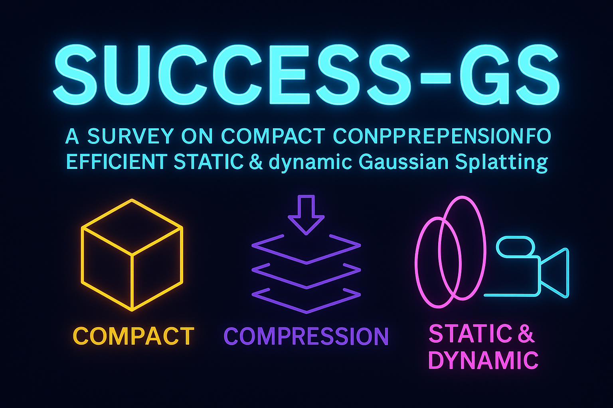
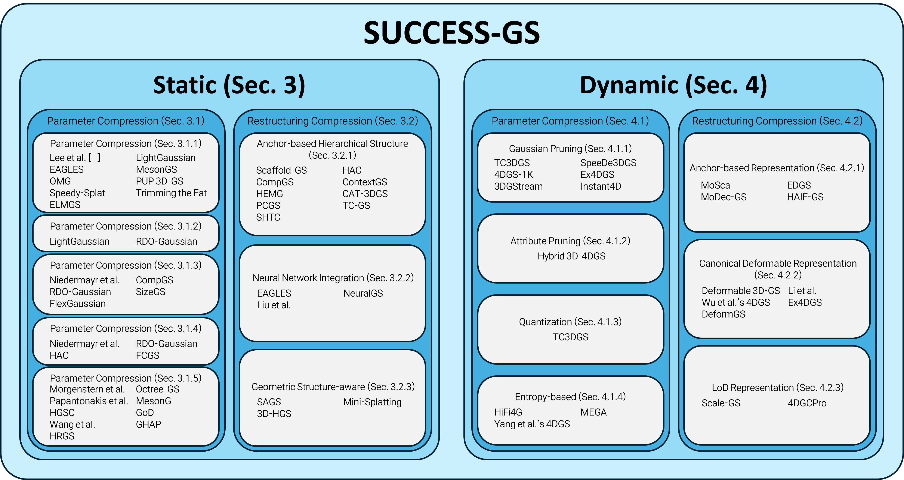

# Awesome-Efficient-GS: Compactness and Compression

### 🏆 SUCCESS-GS: Survey of Compactness and Compression for Efficient Static and Dynamic Gaussian Splatting

<p align="center">
  
</p>


[](https://github.com/sindresorhus/awesome)
[](https://github.com/CMLab-Korea/SUCCESS-GS)
[]()
[](https://github.com/CMLab-Korea/SUCCESS-GS/stargazers)

This repository provides a curated collection of papers, benchmarks, and resources from our survey:  
**"SUCCESS-GS: Survey of Compactness and Compression for Efficient Static and Dynamic Gaussian Splatting"** (arXiv2025).

> 📝 **Authors**: Seokhyun Youn<sup>1*</sup>, Soohyun Lee<sup>2*</sup>, Geonho Kim<sup>1*</sup>, Weeyoung Kwon<sup>1</sup>, Sung-Ho Bae<sup>2†</sup>, and Jihyong Oh<sup>1†</sup>

> 🎓 **Institution**: </br>
> * <sup>1</sup> **Chung-Ang University**, South Korea </br>
> * <sup>2</sup> **Kyung Hee University**, South Korea

> * <sup>*</sup> These authors contributed equally to this paper.
> * <sup>†</sup> Co-corresponding authors.
---

## 📘 Abstract

 3D Gaussian Splatting (3DGS) has emerged as a powerful explicit representation enabling real-time, high-fidelity 3D reconstruction and novel view synthesis. However, its practical use is hindered by the massive memory and computational demands required to store and render millions of Gaussians. These challenges become even more severe in 4D dynamic scenes. To address these issues, the field of Efficient Gaussian Splatting has rapidly evolved, proposing methods that reduce redundancy while preserving reconstruction quality. This survey provides the first unified overview of efficient 3D and 4D Gaussian Splatting techniques. For both 3D and 4D settings, we systematically categorize existing methods into two major directions, Parameter Compression and Restructuring Compression, and comprehensively summarize the core ideas and methodological trends within each category. We further cover widely used datasets, evaluation metrics, and representative benchmark comparisons. Finally, we discuss current limitations and outline promising research directions toward scalable, compact, and real-time Gaussian Splatting for both static and dynamic 3D scene representation. Our project page is available at the following link: https://cmlab-korea.github.io/Awesome-Efficient-GS/


---

## 📚 Contents

- [📣 News](#-news)
- [🔖 Citation](#-citation)
- [🔍 Survey Paper](#-survey-paper)
- [📄 Paper List](#-paper-list)
- [📊 Experimental Setup](#-experimental--setup)

---

## 📣 News

- 📌 2025-12: Paper released to ArXiv.
- 🚀 2025-12: Repository initialized.

---

## 🔖 Citation

If you find this survey helpful, please consider citing us:

```citation
@article{SUCCESS-GS,
  title={SUCCESS-GS: Survey of Compactness and Compression for Efficient Static and Dynamic Gaussian Splatting},
  author={Youn, Seokhuyn and Lee, Soohyun and Kim, Geonho and Bae, Sungho and Oh, Jihyong},
  journal={??},
  year={2025}
}
```
---

## 🧩 Community Contribution

We welcome contributions from the Efficient Gaussian Splatting research community!

If you have a new method, dataset, benchmark, or related resource relevant to Efficient 3DGS or Efficient 4DGS, feel free to submit a Pull Request (PR) with the following information:
- **A brief description** of your method/resource
- **Relevant links**, such as arXiv papers, project pages, demos, or code repositories
- **Suggested placement**, e.g.,
  - “3.1. Parameter Compression – Quantization”
  - “4.2. Restructuring Compression – Hierarchical Anchors”
  - “5. Evaluation – Datasets and Benchmarks”

Our maintainers will review submissions and merge them when appropriate.
We aim for this repository to become a collaborative hub for the Efficient Gaussian Splatting community—covering topics such as:
- **Parameter Compression**
- **Restructuring Compression** 

Together, we hope to accelerate the development of scalable, compact, and high-performance 3D/4D Gaussian Splatting frameworks.

---

## 🏆 Survey Paper

You can find the preprint of our survey here:  아카이브 링크추가.


The overview of our survey paper (Our survey includes works available up to November 28, 2025.):


---

## 📄 Paper List

We categorize recent Efficient 3D/4DGS papers by methodology (up to November 28, 2025):  


## 3.STATIC

### 3.1. Parameter Compression
### 3.1.1. Pruning

<table>
<thead>
<tr>
<th align="left">Title</th>
<th align="center">Publication</th>
<th align="center">Date</th>
<th align="center">Tags</th>
</tr>
</thead>
<tbody>
<tr>
  <td align="left">
    <a href="https://doi.org/10.1109/CVPR52733.2024.02052">
      Compact 3D Gaussian Representation for Radiance Field
    </a>
  </td>
  <td align="center">CVPR</td>
  <td align="center">2024</td>
<td align="center">Learnable mask-based</td>
</tr>
<tr>
  <td align="left">
    <a href="https://proceedings.neurips.cc/paper_files/paper/2024/file/fd881d3b625437354d4421818f81058f-Paper-Conference.pdf">
      LightGaussian: Unbounded 3D Gaussian Compression with 15x Reduction and 200+ FPS
    </a>
  </td>
  <td align="center">NeurIPS</td>
  <td align="center">2024</td>
<td align="center">Significance Score-based</td>
</tr>
<tr>
  <td align="left">
    <a href="https://link.springer.com/chapter/10.1007/978-3-031-73036-8_4">
      Eagles: Efficient Accelerated 3D Gaussians with Lightweight Encodings
    </a>
  </td>
  <td align="center">ECCV</td>
  <td align="center">2024</td>
<td align="center">Significance Score-based</td>
</tr>  
<tr>
  <td align="left">
    <a href="https://link.springer.com/chapter/10.1007/978-3-031-73414-4_25">
      MesonGS: Post-training Compression of 3D Gaussians via Efficient Attribute Transformation
    </a>
  </td>
  <td align="center">ECCV</td>
  <td align="center">2024</td>
<td align="center">Significance Score-based</td>
</tr>
<tr>
  <td align="left">
    <a href="https://arxiv.org/abs/2503.16924">
       Optimized Minimal 3D Gaussian Splatting
    </a>
  </td>
  <td align="center">NeurIPS</td>
  <td align="center">2025</td>
<td align="center">Significance Score-based</td>
</tr>
<tr>
  <td align="left">
    <a href="https://ieeexplore.ieee.org/document/11092397/">
       Pup 3D-GS: Principled Uncertainty Pruning for 3D Gaussian Splatting.
    </a>
  </td>
  <td align="center">CVPR</td>
  <td align="center">2025</td>
<td align="center">Gradient-based</td>
<tr>
  <td align="left">
    <a href="https://ieeexplore.ieee.org/document/11094159">
      Speedy-Splat: Fast 3D Gaussian Splatting with Sparse Pixels and Sparse Primitives
    </a>
  </td>
  <td align="center">CVPR</td>
  <td align="center">2025</td>
<td align="center">Gradient-based</td>
</tr>
<tr>
  <td align="left">
    <a href="https://arxiv.org/abs/2406.18214">
 Trimming the Fat: Efficient Compression of 3D Gaussian Splats through Pruning.    
    </a>
  </td>
  <td align="center">BMVC</td>
  <td align="center">2024</td>
<td align="center">Gradient-based</td>
</tr>
<tr>
  <td align="left">
    <a href="https://ieeexplore.ieee.org/document/10943631">
      Elmgs: Enhancing Memory and Computation Scalability through Compression for
3D Gaussian Splatting.  
    </a>
  </td>
  <td align="center">WACV</td>
  <td align="center">2025</td>
<td align="center">Gradient-based</td>
</tr>

</tr>
</tbody>
</table>

### 3.1.2. Attribute Pruning
<table>
<thead>
<tr>
<th align="left">Title</th>
<th align="center">Publication</th>
<th align="center">Date</th>

</tr>
</thead>
<tbody>

<tr>
  <td align="left">
    <a href="https://proceedings.neurips.cc/paper_files/paper/2024/file/fd881d3b625437354d4421818f81058f-Paper-Conference.pdf">
      LightGaussian: Unbounded 3D Gaussian Compression with 15x Reduction and 200+ FPS
    </a>
  </td>
  <td align="center">NeurIPS</td>
  <td align="center">2024</td>
</tr>
<tr>
  <td align="left">
    <a href="https://link.springer.com/chapter/10.1007/978-3-031-73636-0_5">
     End-to-end Rate-distortion Optimized 3D Gaussian Representation
    </a>
  </td>
  <td align="center">ECCV</td>
  <td align="center">2024</td>
</tr>
</tbody>
</table>


### 3.1.3. Quantization
<table>
<thead>
<tr>
<th align="left">Title</th>
<th align="center">Publication</th>
<th align="center">Date</th>
</tr>
</thead>
<tbody>

<tr>
  <td align="left">
    <a href="https://ieeexplore.ieee.org/document/10655416">
       Compressed 3D Gaussian Splatting for Accelerated Novel View Synthesis.
    </a>
  </td>
  <td align="center">CVPR</td>
  <td align="center">2024</td>
</tr>
<tr>
  <td align="left">
    <a href="https://doi.org/10.1109/CVPR52733.2024.02052">
      Compact 3D Gaussian Representation for Radiance Field
    </a>
  </td>
  <td align="center">CVPR</td>
  <td align="center">2024</td>
</tr>
<tr>
  <td align="left">
    <a href="https://proceedings.neurips.cc/paper_files/paper/2024/file/fd881d3b625437354d4421818f81058f-Paper-Conference.pdf">
      LightGaussian: Unbounded 3D Gaussian Compression with 15x Reduction and 200+ FPS
    </a>
  </td>
  <td align="center">NeurIPS</td>
  <td align="center">2024</td>
</tr>
<tr>
  <td align="left">
    <a href="https://link.springer.com/chapter/10.1007/978-3-031-73636-0_5">
     End-to-end Rate-distortion Optimized 3D Gaussian Representation
    </a>
  </td>
  <td align="center">ECCV</td>
  <td align="center">2024</td>
</tr>
<tr>
  <td align="left">
    <a href="https://link.springer.com/chapter/10.1007/978-3-031-73411-3_19">
       CompGS: Smaller and Faster Gaussian Splatting with Vector Quantization.
    </a>
  </td>
  <td align="center">ECCV</td>
  <td align="center">2024</td>
</tr>
<tr>
  <td align="left">
    <a href="https://dl.acm.org/doi/10.1145/3746027.3755370">
      SizeGS: Size-aware Compression of 3D Gaussians with Hierarchical Mixed Precision Quantization
    </a>
  </td>
  <td align="center">ACM MM</td>
  <td align="center">2024</td>
</tr>
<tr>
  <td align="left">
    <a href="https://dl.acm.org/doi/pdf/10.1145/3746027.3754744">
       Flexgaussian: Flexible and Cost-effective Training-free Compression for 3D Gaussian Splatting
    </a>
  </td>
  <td align="center">ACM MM</td>
  <td align="center">2025</td>
</tr>
</tbody>
</table>

### 3.1.4. Entropy Coding
<table>
<thead>
<tr>
<th align="left">Title</th>
<th align="center">Publication</th>
<th align="center">Date</th>

</tr>
</thead>
<tbody>

<tr>
  <td align="left">
    <a href="https://ieeexplore.ieee.org/document/10655416">
       Compressed 3D Gaussian Splatting for Accelerated Novel View Synthesis.
    </a>
  </td>
  <td align="center">CVPR</td>
  <td align="center">2024</td>
</tr>
<tr>
  <td align="left">
    <a href="https://link.springer.com/chapter/10.1007/978-3-031-73636-0_5">
     End-to-end Rate-distortion Optimized 3D Gaussian Representation
    </a>
  </td>
  <td align="center">ECCV</td>
  <td align="center">2024</td>
</tr>
<tr>
  <td align="left">
    <a href="https://link.springer.com/chapter/10.1007/978-3-031-72667-5_24">
      HAC: Hash-grid Assisted Context for 3D Gaussian Splatting Compression
    </a>
  </td>
  <td align="center">ECCV</td>
  <td align="center">2024</td>
</tr>
<tr>
  <td align="left">
    <a href="https://arxiv.org/abs/2410.08017">
      Fast Feedforward 3D Gaussian Splatting Compression.
    </a>
  </td>
  <td align="center">ICLR</td>
  <td align="center">2024</td>
</tr>
</tbody>
</table>

### 3.1.5. Structured Compression
<table>
<thead>
<tr>
<th align="left">Title</th>
<th align="center">Publication</th>
<th align="center">Date</th>
</tr>
</thead>
<tbody>

<tr>
  <td align="left">
    <a href="https://link.springer.com/chapter/10.1007/978-3-031-73013-9_2">
     Compact 3D Scene Representation via Self-organizing Gaussian Grids
    </a>
  </td>
  <td align="center">ECCV</td>
  <td align="center">2024</td>
</tr>
<tr>
  <td align="left">
    <a href="https://ieeexplore.ieee.org/document/10993308">
 Octree-GS: Towards Consistent Real-time Rendering with
Lod-structured 3D Gaussians
    </a>
  </td>
  <td align="center">TPAMI</td>
  <td align="center">2025</td>
</tr>
<tr>
  <td align="left">
    <a href="https://dl.acm.org/doi/10.1145/3651282">
       Reducing the Memory Footprint of 3D
Gaussian Splatting
    </a>
  </td>
  <td align="center">SIGGRAPH</td>
  <td align="center">2024</td>
</tr>
<tr>
  <td align="left">
    <a href="https://link.springer.com/chapter/10.1007/978-3-031-73414-4_25">
       MesonGS: Post-training Compression of 3D Gaussians via Efficient Attribute Transformation
    </a>
  </td>
  <td align="center">ECCV</td>
  <td align="center">2024</td>
</tr>
<tr>
  <td align="left">
    <a href="https://ieeexplore.ieee.org/document/10887742">
      A Hierarchical Compression Technique for 3D Gaussian Splatting Compression
    </a>
  </td>
  <td align="center">ICASSP</td>
  <td align="center">2025</td>
</tr>
<tr>
  <td align="left">
    <a href="https://arxiv.org/abs/2501.13558">
        GoDe: Gaussians on Demand for Progressive
Level of Detail and Scalable Compression
    </a>
  </td>
  <td align="center">CVPR</td>
  <td align="center">2025</td>
</tr>
<tr>
  <td align="left">
    <a href="https://arxiv.org/abs/2506.00271">
      Adaptive Voxelization for Transform coding of 3D Gaussian splatting data
    </a>
  </td>
  <td align="center">arxiv</td>
  <td align="center">2025</td>
</tr>
<tr>
  <td align="left">
    <a href="https://arxiv.org/abs/2506.09534">
       Gaussian Herding across Pens: An Optimal Transport Perspective on Global Gaussian Reduction for 3DGS
    </a>
  </td>
  <td align="center">NeurIPS</td>
  <td align="center">2025</td>
</tr>
<tr>
  <td align="left">
    <a href="https://arxiv.org/abs/2506.14229">
       HRGS: Hierarchical Gaussian Splatting for Memory-Efficient High-Resolution 3D Reconstruction
    </a>
  </td>
  <td align="center">arxiv</td>
  <td align="center">2025</td>
</tr>

</tbody>
</table>


## 3.2. Restructuring Compression
### 3.2.1. Anchor-based Hierarchical Structure
<table>
<thead>
<tr>
<th align="left">Title</th>
<th align="center">Publication</th>
<th align="center">Date</th>
</tr>
</thead>
<tbody>

<tr>
  <td align="left">
    <a href="https://ieeexplore.ieee.org/document/10658518">
      Scaffold-GS: Structured 3D Gaussians for View-Adaptive Rendering
    </a>
  </td>
  <td align="center">CVPR</td>
  <td align="center">2024</td>
</tr>
<tr>
  <td align="left">
    <a href="https://link.springer.com/chapter/10.1007/978-3-031-72667-5_24">
      HAC: Hash-grid Assisted Context for 3D Gaussian Splatting Compression
    </a>
  </td>
  <td align="center">ECCV</td>
  <td align="center">2024</td>
</tr>
<tr>
  <td align="left">
    <a href="https://dl.acm.org/doi/proceedings/10.1145/3664647">
    CompGS: Efficient 3D Scene Representation via Compressed Gaussian Splatting
    </a>
  </td>
  <td align="center">ACM MM</td>
  <td align="center">2024</td>
</tr>
<tr>
  <td align="left">
    <a href="https://proceedings.neurips.cc/paper_files/paper/2024/file/5c20ca4b0b20b0bd2f1d839dc605e70f-Paper-Conference.pdf">
      ContextGS: Compact 3D Gaussian Splatting with
Anchor Level Context Model
    </a>
  </td>
  <td align="center">NeurIPS</td>
  <td align="center">2024</td>
</tr>
<tr>
  <td align="left">
    <a href="https://arxiv.org/abs/2411.18473">
     HEMGS: A Hybrid Entropy Model for 3D Gaussian Splatting Data Compression.
    </a>
  </td>
  <td align="center">arxiv</td>
  <td align="center">2024</td>
</tr>
<tr>
  <td align="left">
    <a href="https://arxiv.org/abs/2503.00357">
      CAT-3DGS: A Context-Adaptive Triplane Approach to Rate-Distortion-Optimized 3DGS Compression
    </a>
  </td>
  <td align="center">ICLR</td>
  <td align="center">2025</td>
</tr>
<tr>
  <td align="left">
    <a href="https://arxiv.org/abs/2503.08511">
PCGS: Progressive Compression of 3D Gaussian Splatting    
    </a>
  </td>
  <td align="center">AAAI</td>
  <td align="center">2025</td>
</tr>
<tr>
  <td align="left">
    <a href="https://arxiv.org/abs/2503.20221">
      TC-GS: Tri-plane based compression for 3D Gaussian Splatting
    </a>
  </td>
  <td align="center">ICME</td>
  <td align="center">2025</td>
</tr>
<tr>
  <td align="left">
    <a href="https://arxiv.org/abs/2505.22908">
     3DGS Compression with Sparsity-guided Hierarchical Transform Coding
    </a>
  </td>
  <td align="center">arxiv</td>
  <td align="center">2025</td>
</tr>
</tbody>
</table>

### 3.2.2. Neural Network Integration
<table>
<thead>
<tr>
<th align="left">Title</th>
<th align="center">Publication</th>
<th align="center">Date</th>
</tr>
</thead>
<tbody>

<tr>
  <td align="left">
    <a href="https://link.springer.com/chapter/10.1007/978-3-031-73036-8_4">
      EAGLES: Efficient Accelerated 3D Gaussians with Lightweight EncodingS
    </a>
  </td>
  <td align="center">ECCV</td>
  <td align="center">2024</td>
</tr>
<tr>
  <td align="left">
    <a href="https://arxiv.org/abs/2503.23162">
NeuralGS: Bridging Neural Fields and 3D Gaussian Splatting for Compact 3D Representations    </a>
  </td>
  <td align="center">AAAI</td>
  <td align="center">2025</td>
</tr>
<tr>
  <td align="left">
    <a href="https://dl.acm.org/doi/10.1145/3746027.3755432">
3D Gaussian Splatting Data Compression with Mixture of Priors
    </a>
  </td>
  <td align="center">ACM MM</td>
  <td align="center">2025</td>
</tr>
</tbody>
</table>

### 3.2.3. Geometric Structure-aware
<table>
<thead>
<tr>
<th align="left">Title</th>
<th align="center">Publication</th>
<th align="center">Date</th>
</tr>
</thead>
<tbody>
<tr>
  <td align="left">
    <a href="https://link.springer.com/chapter/10.1007/978-3-031-72655-2_13">
      SAGS: Structure-Aware 3D Gaussian Splatting
    </a>
  </td>
  <td align="center">ECCV</td>
  <td align="center">2024</td>
</tr>
  
<tr>
  <td align="left">
    <a href="https://link.springer.com/chapter/10.1007/978-3-031-72655-2_13">
       Mini-Splatting: Representing Scenes with a Constrained Number of Gaussians
    </a>
  </td>
  <td align="center">ECCV</td>
  <td align="center">2024</td>
</tr>
<tr>
  <td align="left">
    <a href="https://arxiv.org/abs/2406.02720">
     3D-HGS: 3D Half-Gaussian Splatting
    </a>
  </td>
  <td align="center">CVPR</td>
  <td align="center">2025</td>
</tr>

</tbody>
</table>

## 4. DYNAMIC

### 4.1. Parameter Compression
### 4.1.1. Gaussian Pruning
<table>
<thead>
<tr>
<th align="left">Title</th>
<th align="center">Publication</th>
<th align="center">Date</th>
</tr>
</thead>
<tbody>
<tr>
  <td align="left">
    <a href="https://arxiv.org/abs/2412.05700">
      Temporally Compressed 3D Gaussian Splatting for Dynamic Scenes
    </a>
  </td>
  <td align="center">arxiv</td>
  <td align="center">2024</td>
</tr>
<tr>
  <td align="left">
    <a href="https://arxiv.org/abs/2506.07917">
Speedy Deformable 3D Gaussian Splatting: Fast Rendering and Compression of Dynamic Scenes
    </a>
  </td>
  <td align="center">arxiv</td>
  <td align="center">2025</td>
</tr>
<tr>
  <td align="left">
    <a href="https://arxiv.org/abs/2503.16422">
      1000+ FPS 4D Gaussian Splatting for Dynamic Scene Rendering
    </a>
  </td>
  <td align="center">NeurIPS</td>
  <td align="center">2025</td>
</tr>
<tr>
  <td align="left">
    <a href="https://proceedings.neurips.cc/paper_files/paper/2024/file/09b47a77997b7dd7d2b26bd8ff769392-Paper-Conference.pdf">
     Fully Explicit Dynamic Gaussian Splatting. In Advances
in Neural Information Processing Systems
    </a>
  </td>
  <td align="center">NeurIPS</td>
  <td align="center">2024</td>
</tr>
<tr>
  <td align="left">
    <a href="https://ieeexplore.ieee.org/document/10655553">
3DGStream: On-the-Fly Training of 3D Gaussians for Efficient Streaming of Photo-Realistic Free-Viewpoint Videos
    </a>
  </td>
  <td align="center">CVPR</td>
  <td align="center">2024</td>
</tr>
<tr>
  <td align="left">
    <a href="https://arxiv.org/abs/2510.01119">
      Instant4D: 4D Gaussian Splatting in Minutes
    </a>
  </td>
  <td align="center">NeurIPS</td>
  <td align="center">2025</td>
</tr>


</tbody>
</table>

### 4.1.2. Attribute Pruning
<table>
<thead>
<tr>
<th align="left">Title</th>
<th align="center">Publication</th>
<th align="center">Date</th>

</tr>
</thead>
<tbody>
<tr>
  <td align="left">
    <a href="https://arxiv.org/abs/2505.13215">
     Hybrid 3D-4D Gaussian Splatting for Fast Dynamic Scene Representation
    </a>
  </td>
  <td align="center">arxiv</td>
  <td align="center">2025</td>
</tr>

</tbody>
</table>

### 4.1.3. Quantization
<table>
<thead>
<tr>
<th align="left">Title</th>
<th align="center">Publication</th>
<th align="center">Date</th>

</tr>
</thead>
<tbody>
<tr>
  <td align="left">
    <a href="https://arxiv.org/abs/2412.05700">
      Temporally Compressed 3D Gaussian Splatting for Dynamic Scenes
    </a>
  </td>
  <td align="center">arxiv</td>
  <td align="center">2024</td>
</tr>

</tbody>
</table>

### 4.1.4. Entropy-based
<table>
<thead>
<tr>
<th align="left">Title</th>
<th align="center">Publication</th>
<th align="center">Date</th>

</tr>
</thead>
<tbody>
<tr>
  <td align="left">
    <a href="https://ieeexplore.ieee.org/document/10658408">
    HiFi4G: High-Fidelity Human Performance Rendering via Compact Gaussian Splatting
    </a>
  </td>
  <td align="center">CVPR</td>
  <td align="center">2024</td>
</tr>
<tr>
  <td align="left">
    <a href="https://arxiv.org/abs/2410.13613">
      MEGA: Memory-Efficient 4D Gaussian Splatting for Dynamic Scenes
    </a>
  </td>
  <td align="center">ICCV</td>
  <td align="center">2025</td>
</tr>
<tr>
  <td align="left">
    <a href="https://arxiv.org/pdf/2310.10642">
 Real-Time Photorealistic Dynamic Scene Representation and Rendering with 4D Gaussian
Splatting
    </a>
  </td>
  <td align="center">ICLR</td>
  <td align="center">2024</td>
</tr>

</tbody>
</table>

### 4.2. Restructuring Compression
### 4.2.1. Anchor-based Representation
<table>
<thead>
<tr>
<th align="left">Title</th>
<th align="center">Publication</th>
<th align="center">Date</th>
</tr>
</thead>
<tbody>
<tr>
  <td align="left">
    <a href="https://ieeexplore.ieee.org/document/11094310">
      MoSca: Dynamic Gaussian Fusion from Casual Videos via 4D Motion Scaffolds
    </a>
  </td>
  <td align="center">ICASSP</td>
  <td align="center">2024</td>
</tr>
<tr>
  <td align="left">
    <a href="https://ojs.aaai.org/index.php/AAAI/article/view/32460">
Efficient Gaussian Splatting for Monocular Dynamic Scene Rendering via Sparse Time-Variant Attribute Modeling
    </a>
  </td>
  <td align="center">AAAI</td>
  <td align="center">2025</td>
</tr>
<tr>
  <td align="left">
    <a href="https://ieeexplore.ieee.org/document/11093901">
      MoDec-GS: Global-to-Local Motion Decomposition and Temporal Interval Adjustment for Compact Dynamic 3D Gaussian Splatting
    </a>
  </td>
  <td align="center">CVPR</td>
  <td align="center">2025</td>
</tr>
<tr>
  <td align="left">
    <a href="https://arxiv.org/abs/2506.09518">
     HAIF-GS: Hierarchical and Induced Flow-Guided Gaussian Splatting for Dynamic Scene
    </a>
  </td>
  <td align="center">NeurIPS</td>
  <td align="center">2025</td>
</tr>

</tbody>
</table>

### 4.2.2. Canonical Deformable Representation
<table>
<thead>
<tr>
<th align="left">Title</th>
<th align="center">Publication</th>
<th align="center">Date</th>
<th align="center">Tags</th>
</tr>
</thead>
<tbody>
<tr>
  <td align="left">
    <a href="https://ieeexplore.ieee.org/document/10657752">
      Deformable 3D Gaussians for High-Fidelity Monocular Dynamic Scene Reconstruction
    </a>
  </td>
  <td align="center">CVPR</td>
  <td align="center">2024</td>
  <td align="center">Implicit Deformation</td>
</tr>
<tr>
  <td align="left">
    <a href="https://ieeexplore.ieee.org/document/106567740">
4D Gaussian Splatting for Real-Time Dynamic Scene Rendering
    </a>
  </td>
  <td align="center">CVPR</td>
  <td align="center">2024</td>
  <td align="center">Implicit Deformation</td>
</tr>
<tr>
  <td align="left">
    <a href="https://arxiv.org/abs/2312.00583">
    DeformGS: Scene Flow in Highly Deformable Scenes for Deformable Object Manipulation
    </a>
  </td>
  <td align="center">WAFR</td>
  <td align="center">2024</td>
  <td align="center">Implicit Deformation</td>
</tr>
<tr>
  <td align="left">
    <a href="https://ieeexplore.ieee.org/document/10657623">
     Spacetime Gaussian Feature Splatting for Real-Time Dynamic View Synthesis
    </a>
  </td>
  <td align="center">CVPR</td>
  <td align="center">2024</td>
  <td align="center">Explicit Deformation</td>
</tr>
  <td align="left">
    <a href="https://proceedings.neurips.cc/paper_files/paper/2024/file/09b47a77997b7dd7d2b26bd8ff769392-Paper-Conference.pdf">
     Fully Explicit Dynamic Gaussian Splatting. In Advances
in Neural Information Processing Systems
    </a>
  </td>
  <td align="center">NeurIPS</td>
  <td align="center">2024</td>
  <td align="center">Explicit Deformation</td>
</tr>

</tbody>
</table>

### 4.2.3. LoD Representation
<table>
<thead>
<tr>
<th align="left">Title</th>
<th align="center">Publication</th>
<th align="center">Date</th>
</tr>
</thead>
<tbody>
<tr>
  <td align="left">
    <a href="https://arxiv.org/abs/2508.21444">
      Scale-GS: Efficient Scalable Gaussian Splatting via
Redundancy-filtering Training on Streaming Content
    </a>
  </td>
  <td align="center">arxiv</td>
  <td align="center">2025</td>
</tr>
<tr>
  <td align="left">
    <a href="https://arxiv.org/abs/2509.17513">
4DGCPro: Efficient Hierarchical 4D Gaussian Compression for Progressive Volumetric Video Streaming
    </a>
  </td>
  <td align="center">NeurIPS</td>
  <td align="center">2025</td>
</tr>


</tbody>
</table>

## 5. Experimental Setup

## 📊 5.1. Datasets

We summarize commonly used datasets for static and dynamic scenes.\

### For static scenes
| **Dataset**              | Venue |  Type  | Modality |   #Views   | #Scenes| Resolution | Environment |
|--------------------------|-------|--------|----------|------------|--------|------------|-------------|
| [TNT](https://www.tanksandtemples.org/download/)| ToG'17 | Real | Multi-view     | 100-400     | 14| 1920 × 1080    | Mixed  |
| [Deep Blending](http://visual.cs.ucl.ac.uk/pubs/deepblending/) | ToG'18 | Real | Multi-view | 12–418 | 19 | 1228–2592 × 816–1944 | Mixed |
| [NeRF-Synthetic](https://drive.google.com/drive/folders/1cK3UDIJqKAAm7zyrxRYVFJ0BRMgrwhh4) | ECCV'20 | Synthetic | Multi-view | 300 | 8| 800 × 800 | Indoor |
| [BungeeNeRF](https://drive.google.com/drive/folders/1ybq-BuRH0EEpcp5OZT9xEMi-Px1pdx4D) | ECCV'22 | Mixed | Multi-view | 220–463 | 12  | N/A | Outdoor |
| [Mip-NeRF 360](https://jonbarron.info/mipnerf360/) | CVPR'22 | Real | Multi-view | 100–330 | 9  | 4946 × 3286 | Mixed |

### For dynamic scenes
| **Dataset**              | Venue |  Type  | Modality |   #Views   | #Scenes| #Frames | Resolution | Environment |
|--------------------------|-------|--------|----------|------------|--------|---------|------------|-------------|
| [Technicolor](https://www.interdigital.com/data_sets/light-field-dataset)| CVPR'17 | Real | Multi-view |  16    | 14 | 150-300    | 1920 × 1080    | Mixed  |
| [D-NeRF](https://www.albertpumarola.com/research/D-NeRF/index.html) | CVPR'21 | Synthetic | Multi-view | 100–200 | 8  | 50–200 | 800 × 800 | Mixed |
| [HyperNeRF](https://hypernerf.github.io/) | SIGGRAPH Asia'21 | Real | Monocular | 1–2 | 7  | 450–900 | 1980 × 1080 | Indoor |
| [N3DV](https://neural-3d-video.github.io) | CVPR'22 | Real | Multi-view | 18–21 | 6 | 300 | 2704 × 2028 | Indoor |
| [NeRF-DS](https://jokeryan.github.io/projects/nerf-ds/) | CVPR'23 | Real | Multi-view | 2 | 8  | 500 | 480 × 270 | Indoor |


## 📈 5.2. Evaluation Metrics

This section summarizes commonly used metrics for evaluating the quality of 3D low-level vision results.

| Title                                                              | Publication (Venue / Journal)| Tags | Year |
| -------------------------------------------------------------      | -----------------------------| ---- | ---- |
| [PSNR](https://en.wikipedia.org/wiki/Peak_signal-to-noise_ratio)| - | Full-Reference | - |
| [SSIM](https://ieeexplore.ieee.org/stamp/stamp.jsp?tp=&arnumber=1284395)| IEEE TIP | Full-Reference | 2004 |
| [LPIPS](https://openaccess.thecvf.com/content_cvpr_2018/html/Zhang_The_Unreasonable_Effectiveness_CVPR_2018_paper.html)| CVPR | Full-Reference | 2018 ||
---

### 🆚 Full-reference Metric

These metrics compare each interpolated frame to its ground truth (GT) reference on a pixel level.

- <a href="https://en.wikipedia.org/wiki/Peak_signal-to-noise_ratio" target="_blank"><strong>PSNR (Peak Signal-to-Noise Ratio)</strong></a>
  <br> Measures reconstruction fidelity via Mean Squared Error (MSE).
  <br> 📌 Higher is better, but it often doesn't align with human perception, especially in high-frequency regions.

- <a href="https://ieeexplore.ieee.org/stamp/stamp.jsp?tp=&arnumber=1284395" target="_blank"><strong>SSIM (Structural Similarity Index)</strong></a>
  <br> Compares luminance, contrast, and texture to evaluate structural similarity.
  <br> 📌 More perceptually aligned than PSNR. Higher SSIM indicates stronger similarity.

- <a href="https://openaccess.thecvf.com/content_cvpr_2018/html/Zhang_The_Unreasonable_Effectiveness_CVPR_2018_paper.html" target="_blank"><strong>LPIPS (Learned Perceptual Image Patch Similarity)</strong></a>
  <br>Measures perceptual similarity between image patches using deep network features (e.g., from VGG or AlexNet).
  <br>📌 Strong alignment with human perception but dependent on network backbone and training data.

---

### 📊 No-reference Metric
- <strong>Model Size</strong>
  <br>Measures the model size either in megabytes or in term of the total number of Gaussians.
  <br> 📌Smaller model size indicates more compact representations and better memory efficiency.

- <strong>Compression Ratio / Reduction Percentage</strong>
  <br>Measures the degree of compactness achieved compared to the original model.
  <br> 📌Higher compression ratio (or reduction percentage) reflects more effective
elimination of redundancy while ideally preserving rendering quality.

- <strong>Training Time</strong>
  <br>Represents the total time required to optimize the model from initialization to convergence.
  <br> 📌Faster training time highlights the practicality of a method, particularly for large-scale or dynamic scenes.

- <strong>Inference FPS (Frames Per Second)</strong>
  <br>Represents the total time required to optimize the model from initialization to convergence.
  <br> 📌Higher FPS values are crucial for interactive applications such as AR/VR and
robotics.
---


## 💫 Star History

[](https://www.star-history.com/#CMLab-Korea/SUCCESS-GS&Date)
