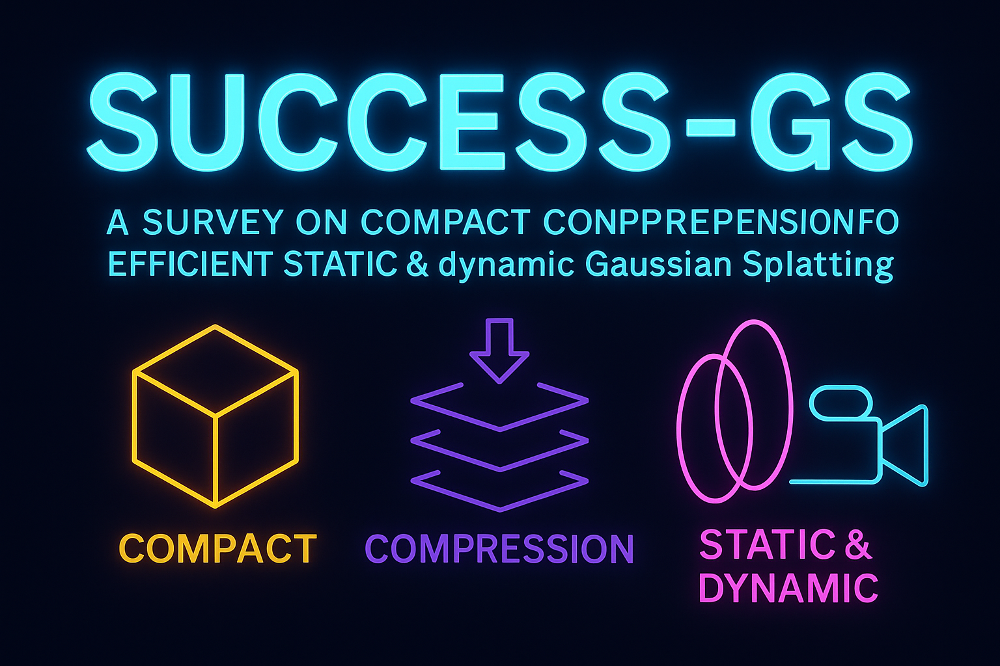

# Awesome-Efficient-GS: Compactness and Compression

### 🏆 SUCCESS-GS: Survey of Compactness and Compression for Efficient Static and Dynamic Gaussian Splatting

<p align="center">
  
</p>


[](https://github.com/sindresorhus/awesome)
[](https://github.com/CMLab-Korea/SUCCESS-GS)
[](https://arxiv.org/abs/2512.07197)
[](https://github.com/CMLab-Korea/SUCCESS-GS/stargazers)

This repository provides a curated collection of papers, benchmarks, and resources from our survey:  
**"SUCCESS-GS: Survey of Compactness and Compression for Efficient Static and Dynamic Gaussian Splatting"** (arXiv2025).

> 📝 **Authors**: Seokhyun Youn<sup>1*</sup>, Soohyun Lee<sup>2*</sup>, Geonho Kim<sup>1*</sup>, Weeyoung Kwon<sup>1</sup>, Sung-Ho Bae<sup>2†</sup>, and Jihyong Oh<sup>1†</sup>

> 🎓 **Institution**: </br>
> * <sup>1</sup> **Chung-Ang University**, South Korea </br>
> * <sup>2</sup> **Kyung Hee University**, South Korea

> * <sup>*</sup> These authors contributed equally to this paper.
> * <sup>†</sup> Co-corresponding authors.
---

## 📘 Abstract

 3D Gaussian Splatting (3DGS) has emerged as a powerful explicit representation enabling real-time, high-fidelity 3D reconstruction and novel view synthesis. However, its practical use is hindered by the massive memory and computational demands required to store and render millions of Gaussians. These challenges become even more severe in 4D dynamic scenes. To address these issues, the field of Efficient Gaussian Splatting has rapidly evolved, proposing methods that reduce redundancy while preserving reconstruction quality. This survey provides the first unified overview of efficient 3D and 4D Gaussian Splatting techniques. For both 3D and 4D settings, we systematically categorize existing methods into two major directions, Parameter Compression and Restructuring Compression, and comprehensively summarize the core ideas and methodological trends within each category. We further cover widely used datasets, evaluation metrics, and representative benchmark comparisons. Finally, we discuss current limitations and outline promising research directions toward scalable, compact, and real-time Gaussian Splatting for both static and dynamic 3D scene representation. Our project page is available at the following link: https://cmlab-korea.github.io/Awesome-Efficient-GS/


---

## 📚 Contents

- [📣 News](#-news)
- [🔖 Citation](#-citation)
- [🔍 Survey Paper](#-survey-paper)
- [📄 Paper List](#-paper-list)
- [📊 Experimental Setup](#-experimental--setup)

---

## 📣 News

- 📌 2026.09.11: AAAI 2026 and ECCV 2026 papers updated.
- 📌 2026.07.09: ICML 2026 papers updated.
- 📌 2026.04.10: CVPR 2026 papers updated.
- 📌 2026.02.03: ICLR 2026 papers updated.
- 📌 2025-12: Paper released to ArXiv.
- 🚀 2025-12: Repository initialized.

---

## 🔖 Citation

If you find this survey helpful, please consider citing us:

```citation
@misc{youn2025successgssurveycompactnesscompression,
      title={SUCCESS-GS: Survey of Compactness and Compression for Efficient Static and Dynamic Gaussian Splatting}, 
      author={Seokhyun Youn and Soohyun Lee and Geonho Kim and Weeyoung Kwon and Sung-Ho Bae and Jihyong Oh},
      year={2025},
      eprint={2512.07197},
      archivePrefix={arXiv},
      primaryClass={cs.CV},
      url={https://arxiv.org/abs/2512.07197}, 
}
```
---

## 🧩 Community Contribution

We welcome contributions from the Efficient Gaussian Splatting research community!

If you have a new method, dataset, benchmark, or related resource relevant to Efficient 3DGS or Efficient 4DGS, feel free to submit a Pull Request (PR) with the following information:
- **A brief description** of your method/resource
- **Relevant links**, such as arXiv papers, project pages, demos, or code repositories
- **Suggested placement**, e.g.,
  - “3.1. Parameter Compression – Quantization”
  - “4.2. Restructuring Compression – Hierarchical Anchors”
  - “5. Evaluation – Datasets and Benchmarks”

Our maintainers will review submissions and merge them when appropriate.
We aim for this repository to become a collaborative hub for the Efficient Gaussian Splatting community, covering topics such as:
- **Parameter Compression**
- **Restructuring Compression** 

Together, we hope to accelerate the development of scalable, compact, and high-performance 3D/4D Gaussian Splatting frameworks.

---

## 🏆 Paper Diagram

You can find the preprint of our survey here: https://arxiv.org/abs/2512.07197


Diagram of recent papers, including those covered in the survey (up to April 10, 2026):

<p align="center">
  
</p>

<p align="center">
  
</p>

---

## 📄 Paper List

We categorize recent Efficient 3D/4DGS papers by methodology (up to April 10, 2026):  


## 3.STATIC

### 3.1. Parameter Compression
### 3.1.1. Pruning

<table>
<thead>
<tr>
<th align="left">Title</th>
<th align="center">Publication</th>
<th align="center">Date</th>
<th align="center">Tags</th>
</tr>
</thead>
<tbody>
<tr>
  <td align="left">
    <a href="https://openaccess.thecvf.com/content/CVPR2024/html/Lee_Compact_3D_Gaussian_Representation_for_Radiance_Field_CVPR_2024_paper.html">
      Compact 3D Gaussian Representation for Radiance Field
    </a>
  </td>
  <td align="center">CVPR</td>
  <td align="center">2024</td>
<td align="center">Learnable mask-based</td>
</tr>
<tr>
  <td align="left">
    <a href="https://proceedings.neurips.cc/paper_files/paper/2024/file/fd881d3b625437354d4421818f81058f-Paper-Conference.pdf">
      LightGaussian: Unbounded 3D Gaussian Compression with 15x Reduction and 200+ FPS
    </a>
  </td>
  <td align="center">NeurIPS</td>
  <td align="center">2024</td>
<td align="center">Significance Score-based</td>
</tr>
<tr>
  <td align="left">
    <a href="https://link.springer.com/chapter/10.1007/978-3-031-73036-8_4">
      Eagles: Efficient Accelerated 3D Gaussians with Lightweight Encodings
    </a>
  </td>
  <td align="center">ECCV</td>
  <td align="center">2024</td>
<td align="center">Significance Score-based</td>
</tr>  
<tr>
  <td align="left">
    <a href="https://link.springer.com/chapter/10.1007/978-3-031-73414-4_25">
      MesonGS: Post-training Compression of 3D Gaussians via Efficient Attribute Transformation
    </a>
  </td>
  <td align="center">ECCV</td>
  <td align="center">2024</td>
<td align="center">Significance Score-based</td>
</tr>
<tr>
  <td align="left">
    <a href="https://proceedings.neurips.cc/paper_files/paper/2025/hash/c6048c68a5e34a2bb34f9ad27e0f338b-Abstract-Conference.html">
      Optimized Minimal 3D Gaussian Splatting
    </a>
  </td>
  <td align="center">NeurIPS</td>
  <td align="center">2025</td>
<td align="center">Significance Score-based</td>
</tr>
<tr>
  <td align="left">
    <a href="https://openaccess.thecvf.com/content/CVPR2025/html/Hanson_PUP_3D-GS_Principled_Uncertainty_Pruning_for_3D_Gaussian_Splatting_CVPR_2025_paper.html">
      Pup 3D-GS: Principled Uncertainty Pruning for 3D Gaussian Splatting
    </a>
  </td>
  <td align="center">CVPR</td>
  <td align="center">2025</td>
<td align="center">Gradient-based</td>
</tr>
<tr>
  <td align="left">
    <a href="https://openaccess.thecvf.com/content/CVPR2025/html/Hanson_Speedy-Splat_Fast_3D_Gaussian_Splatting_with_Sparse_Pixels_and_Sparse_CVPR_2025_paper.html">
      Speedy-Splat: Fast 3D Gaussian Splatting with Sparse Pixels and Sparse Primitives
    </a>
  </td>
  <td align="center">CVPR</td>
  <td align="center">2025</td>
<td align="center">Gradient-based</td>
</tr>
<tr>
  <td align="left">
    <a href="https://arxiv.org/abs/2406.18214">
      Trimming the Fat: Efficient Compression of 3D Gaussian Splats through Pruning
    </a>
  </td>
  <td align="center">BMVC</td>
  <td align="center">2024</td>
<td align="center">Gradient-based</td>
</tr>
<tr>
  <td align="left">
    <a href="https://openaccess.thecvf.com/content/WACV2025/html/Ali_ELMGS_Enhancing_Memory_and_Computation_Scalability_through_Compression_for_3D_WACV_2025_paper.html">
      Elmgs: Enhancing Memory and Computation Scalability through Compression for 3D Gaussian Splatting
    </a>
  </td>
  <td align="center">WACV</td>
  <td align="center">2025</td>
<td align="center">Gradient-based</td>
</tr>
<tr>
  <td align="left">
    <a href="https://iclr.cc/virtual/2026/poster/10006810">
      Mobile-GS: Real-time Gaussian Splatting for Mobile Devices
    </a>
  </td>
  <td align="center">ICLR</td>
  <td align="center">2026</td>
<td align="center">Significance Score-based</td>
</tr>
<tr>
  <td align="left">
    <a href="https://iclr.cc/virtual/2026/poster/10010067">
      UrbanGS: Efficient and Scalable Architecture for Geometrically Accurate Large-scene Reconstruction
    </a>
  </td>
  <td align="center">ICLR</td>
  <td align="center">2026</td>
<td align="center">Significance Score-based</td>
</tr>
<tr>
  <td align="left">
    <a href="https://iclr.cc/virtual/2026/poster/10008347">
      MEGS^{2}: Memory-efficient Gaussian Splatting via Spherical Gaussians and Unified Pruning
    </a>
  </td>
  <td align="center">ICLR</td>
  <td align="center">2026</td>
<td align="center">Learnable mask-based</td>
</tr>
<tr>
  <td align="left">
    <a href="https://arxiv.org/abs/2601.00913">
      Clean-GS: Semantic Mask-guided Pruning for 3D Gaussian Splatting
    </a>
  </td>
  <td align="center">arXiv</td>
  <td align="center">2026</td>
<td align="center">Semantic mask-guided</td>
</tr>
<tr>
  <td align="left">
    <a href="https://openaccess.thecvf.com/content/CVPR2025/html/Liu_MaskGaussian_Adaptive_3D_Gaussian_Representation_from_Probabilistic_Masks_CVPR_2025_paper.html">
      MaskGaussian: Adaptive 3D Gaussian Representation from Probabilistic Masks
    </a>
  </td>
  <td align="center">CVPR</td>
  <td align="center">2025</td>
<td align="center">Learnable mask-based</td>
</tr>
<tr>
  <td align="left">
    <a href="https://arxiv.org/abs/2603.23297">
      Drop-In Perceptual Optimization for 3D Gaussian Splatting
    </a>
  </td>
  <td align="center">arXiv</td>
  <td align="center">2026</td>
<td align="center">Gradient-based</td>
</tr>
<tr>
  <td align="left">
    <a href="https://arxiv.org/abs/2603.21933">
      Camera-Agnostic Pruning of 3D Gaussian Splats via Descriptor-Based Beta Evidence
    </a>
  </td>
  <td align="center">arXiv</td>
  <td align="center">2026</td>
<td align="center">Significance Score-based</td>
</tr>
<tr>
  <td align="left">
    <a href="https://arxiv.org/abs/2602.24136">
      Prune Wisely, Reconstruct Sharply: Compact 3D Gaussian Splatting via Adaptive Pruning and Difference-of-Gaussian Primitives
    </a>
  </td>
  <td align="center">arXiv</td>
  <td align="center">2026</td>
<td align="center">Significance Score-based</td>
</tr>
<tr>
  <td align="left">
    <a href="https://openaccess.thecvf.com/content/CVPR2026/html/Yang_RAP_Fast_Feedforward_Rendering-Free_Attribute-Guided_Primitive_Importance_Score_Prediction_for_CVPR_2026_paper.html">
      RAP: Fast Feedforward Rendering-Free Attribute-Guided Primitive Importance Score Prediction for Efficient 3D Gaussian Splatting Processing
    </a>
  </td>
  <td align="center">CVPR</td>
  <td align="center">2026</td>
<td align="center">Significance Score-based</td>
</tr>
<tr>
  <td align="left">
    <a href="https://openaccess.thecvf.com/content/CVPR2026/html/Ren_FastGS_Training_3D_Gaussian_Splatting_in_100_Seconds_CVPR_2026_paper.html">
      FastGS: Training 3D Gaussian Splatting in 100 Seconds
    </a>
  </td>
  <td align="center">CVPR</td>
  <td align="center">2026</td>
<td align="center">Significance Score-based</td>
</tr>
<tr>
  <td align="left">
    <a href="https://openaccess.thecvf.com/content/WACV2026/html/Lee_SafeguardGS_3D_Gaussian_Primitive_Pruning_While_Avoiding_Catastrophic_Scene_Destruction_WACV_2026_paper.html">
      SafeguardGS: 3D Gaussian Primitive Pruning While Avoiding Catastrophic Scene Destruction
    </a>
  </td>
  <td align="center">WACV</td>
  <td align="center">2026</td>
<td align="center">Significance Score-based</td>
</tr>
<tr>
  <td align="left">
    <a href="https://icml.cc/virtual/2026/poster/62260">
      TurboGS: Accelerating 3D Gaussian Splatting via Error-Guided Sparse Pixel Sampling and Optimization
    </a>
  </td>
  <td align="center">ICML</td>
  <td align="center">2026</td>
<td align="center">Significance Score-based</td>
</tr>
<tr>
  <td align="left">
    <a href="https://icml.cc/virtual/2026/poster/64863">
      Beyond Heuristics: Learnable Density Control for 3D Gaussian Splatting
    </a>
  </td>
  <td align="center">ICML</td>
  <td align="center">2026</td>
<td align="center">Significance Score-based</td>
</tr>
<tr>
  <td align="left">
    <a href="https://icml.cc/virtual/2026/poster/65348">
      CoverPruneGS: Coverage-Preserving Structured Pruning for Hierarchical 3D Gaussian Splatting from Sparse-View Monocular Videos
    </a>
  </td>
  <td align="center">ICML</td>
  <td align="center">2026</td>
<td align="center">Gradient-based</td>
</tr>

<tr>
  <td align="left">
    <a href="https://eccv.ecva.net/virtual/2026/poster/4526">
      EAGS: Error-Aware Gaussian Splatting with Dual-Confidence-Guided Modeling for Uncalibrated Driving Scenes
    </a>
  </td>
  <td align="center">ECCV</td>
  <td align="center">2026</td>
<td align="center">Significance Score-based</td>
</tr>
<tr>
  <td align="left">
    <a href="https://eccv.ecva.net/virtual/2026/poster/3772">
      Fast and Compact 3D Gaussian Splatting with Polarized Opacity Prior
    </a>
  </td>
  <td align="center">ECCV</td>
  <td align="center">2026</td>
<td align="center">Learnable mask-based</td>
</tr>
<tr>
  <td align="left">
    <a href="https://eccv.ecva.net/virtual/2026/poster/3858">
      REFINE: Super-efficient Pruning for 3D Gaussian Splatting via Rendering-Free Primitive Importance
    </a>
  </td>
  <td align="center">ECCV</td>
  <td align="center">2026</td>
<td align="center">Significance Score-based</td>
</tr>
<tr>
  <td align="left">
    <a href="https://eccv.ecva.net/virtual/2026/poster/4067">
      Manifold-Aware Spectral Compaction: A Graph Signal Processing Perspective on Online Gaussian Reduction for 3DGS SLAM
    </a>
  </td>
  <td align="center">ECCV</td>
  <td align="center">2026</td>
<td align="center">Spectral-based</td>
</tr>
<tr>
  <td align="left">
    <a href="https://eccv.ecva.net/virtual/2026/poster/3359">
      NanoGS: Training-Free and Lightweight Gaussian Splat Simplification
    </a>
  </td>
  <td align="center">ECCV</td>
  <td align="center">2026</td>
<td align="center">Significance Score-based</td>
</tr>
<tr>
  <td align="left">
    <a href="https://eccv.ecva.net/virtual/2026/poster/3962">
      PointSplat: Compact Gaussian Splatting via Human-Centric Prediction
    </a>
  </td>
  <td align="center">ECCV</td>
  <td align="center">2026</td>
<td align="center">Semantic mask-guided</td>
</tr>
<tr>
  <td align="left">
    <a href="https://openaccess.thecvf.com/content/CVPR2026/html/Yang_GS2_Graph-based_Spatial_Distribution_Optimization_for_Compact_3D_Gaussian_Splatting_CVPR_2026_paper.html">
      GS^2: Graph-based Spatial Distribution Optimization for Compact 3D Gaussian Splatting
    </a>
  </td>
  <td align="center">CVPR</td>
  <td align="center">2026</td>
<td align="center">Significance Score-based</td>
</tr>
<tr>
  <td align="left">
    <a href="https://openaccess.thecvf.com/content/CVPR2026/html/Zhang_SparseSplat_Towards_Applicable_Feed-Forward_3D_Gaussian_Splatting_with_Pixel-Unaligned_Prediction_CVPR_2026_paper.html">
      SparseSplat: Towards Applicable Feed-Forward 3D Gaussian Splatting with Pixel-Unaligned Prediction
    </a>
  </td>
  <td align="center">CVPR</td>
  <td align="center">2026</td>
<td align="center">Significance Score-based</td>
</tr>
<tr>
  <td align="left">
    <a href="https://openaccess.thecvf.com/content/CVPR2026/html/Bui_EcoSplat_Efficiency-controllable_Feed-forward_3D_Gaussian_Splatting_from_Multi-view_Images_CVPR_2026_paper.html">
      EcoSplat: Efficiency-controllable Feed-forward 3D Gaussian Splatting from Multi-view Images
    </a>
  </td>
  <td align="center">CVPR</td>
  <td align="center">2026</td>
<td align="center">Significance Score-based</td>
</tr>
<tr>
  <td align="left">
    <a href="https://iclr.cc/virtual/2026/poster/10011348">
      Gradient-Direction-Aware Density Control for 3D Gaussian Splatting
    </a>
  </td>
  <td align="center">ICLR</td>
  <td align="center">2026</td>
<td align="center">Gradient-based</td>
</tr>
</tbody>
</table>

### 3.1.2. Attribute Pruning
<table>
<thead>
<tr>
<th align="left">Title</th>
<th align="center">Publication</th>
<th align="center">Date</th>

</tr>
</thead>
<tbody>

<tr>
  <td align="left">
    <a href="https://proceedings.neurips.cc/paper_files/paper/2024/file/fd881d3b625437354d4421818f81058f-Paper-Conference.pdf">
      LightGaussian: Unbounded 3D Gaussian Compression with 15x Reduction and 200+ FPS
    </a>
  </td>
  <td align="center">NeurIPS</td>
  <td align="center">2024</td>
</tr>
<tr>
  <td align="left">
    <a href="https://link.springer.com/chapter/10.1007/978-3-031-73636-0_5">
      End-to-end Rate-distortion Optimized 3D Gaussian Representation
    </a>
  </td>
  <td align="center">ECCV</td>
  <td align="center">2024</td>
</tr>
<tr>
  <td align="left">
    <a href="https://iclr.cc/virtual/2026/poster/10008347">
      MEGS^{2}: Memory-efficient Gaussian Splatting via Spherical Gaussians and Unified Pruning
    </a>
  </td>
  <td align="center">ICLR</td>
  <td align="center">2026</td>
</tr>
<tr>
  <td align="left">
    <a href="https://openaccess.thecvf.com/content/CVPR2026/html/Tao_Hierarchical_Visual_Relocalization_with_Nearest_View_Synthesis_from_Feature_Gaussian_CVPR_2026_paper.html">
      Hierarchical Visual Relocalization with Nearest View Synthesis from Feature Gaussian Splatting
    </a>
  </td>
  <td align="center">CVPR</td>
  <td align="center">2026</td>
</tr>
<tr>
  <td align="left">
    <a href="https://openaccess.thecvf.com/content/CVPR2026/html/Fang_Dropping_Anchor_and_Spherical_Harmonics_for_Sparse-view_Gaussian_Splatting_CVPR_2026_paper.html">
      Dropping Anchor and Spherical Harmonics for Sparse-view Gaussian Splatting
    </a>
  </td>
  <td align="center">CVPR</td>
  <td align="center">2026</td>
</tr>
<tr>
  <td align="left">
    <a href="https://eccv.ecva.net/virtual/2026/poster/5695">
      EGGS: Explicitly Granular 3D Gaussian Splatting via Luma-Aware and Volume-Preserving Attribute Factorization
    </a>
  </td>
  <td align="center">ECCV</td>
  <td align="center">2026</td>
</tr>
<tr>
  <td align="left">
    <a href="https://eccv.ecva.net/virtual/2026/poster/5168">
      FLEG: Feed-Forward Language Embedded Gaussian Splatting from Any Views via Compact Semantic Representation
    </a>
  </td>
  <td align="center">ECCV</td>
  <td align="center">2026</td>
</tr>
</tbody>
</table>


### 3.1.3. Quantization
<table>
<thead>
<tr>
<th align="left">Title</th>
<th align="center">Publication</th>
<th align="center">Date</th>
</tr>
</thead>
<tbody>

<tr>
  <td align="left">
    <a href="https://openaccess.thecvf.com/content/CVPR2024/html/Niedermayr_Compressed_3D_Gaussian_Splatting_for_Accelerated_Novel_View_Synthesis_CVPR_2024_paper.html">
      Compressed 3D Gaussian Splatting for Accelerated Novel View Synthesis
    </a>
  </td>
  <td align="center">CVPR</td>
  <td align="center">2024</td>
</tr>
<tr>
  <td align="left">
    <a href="https://openaccess.thecvf.com/content/CVPR2024/html/Lee_Compact_3D_Gaussian_Representation_for_Radiance_Field_CVPR_2024_paper.html">
      Compact 3D Gaussian Representation for Radiance Field
    </a>
  </td>
  <td align="center">CVPR</td>
  <td align="center">2024</td>
</tr>
<tr>
  <td align="left">
    <a href="https://proceedings.neurips.cc/paper_files/paper/2024/file/fd881d3b625437354d4421818f81058f-Paper-Conference.pdf">
      LightGaussian: Unbounded 3D Gaussian Compression with 15x Reduction and 200+ FPS
    </a>
  </td>
  <td align="center">NeurIPS</td>
  <td align="center">2024</td>
</tr>
<tr>
  <td align="left">
    <a href="https://link.springer.com/chapter/10.1007/978-3-031-73636-0_5">
      End-to-end Rate-distortion Optimized 3D Gaussian Representation
    </a>
  </td>
  <td align="center">ECCV</td>
  <td align="center">2024</td>
</tr>
<tr>
  <td align="left">
    <a href="https://link.springer.com/chapter/10.1007/978-3-031-73411-3_19">
      CompGS: Smaller and Faster Gaussian Splatting with Vector Quantization
    </a>
  </td>
  <td align="center">ECCV</td>
  <td align="center">2024</td>
</tr>
<tr>
  <td align="left">
    <a href="https://dl.acm.org/doi/10.1145/3746027.3755370">
      SizeGS: Size-aware Compression of 3D Gaussians with Hierarchical Mixed Precision Quantization
    </a>
  </td>
  <td align="center">ACM MM</td>
  <td align="center">2024</td>
</tr>
<tr>
  <td align="left">
    <a href="https://dl.acm.org/doi/pdf/10.1145/3746027.3754744">
      Flexgaussian: Flexible and Cost-effective Training-free Compression for 3D Gaussian Splatting
    </a>
  </td>
  <td align="center">ACM MM</td>
  <td align="center">2025</td>
</tr>
<tr>
  <td align="left">
    <a href="https://iclr.cc/virtual/2026/poster/10006810">
      Mobile-GS: Real-time Gaussian Splatting for Mobile Devices
    </a>
  </td>
  <td align="center">ICLR</td>
  <td align="center">2026</td>
</tr>
<tr>
  <td align="left">
    <a href="https://openaccess.thecvf.com/content/CVPR2026/html/Bang_LightSplat_Fast_and_Memory-Efficient_Open-Vocabulary_3D_Scene_Understanding_in_Five_CVPR_2026_paper.html">
      LightSplat: Fast and Memory-Efficient Open-Vocabulary 3D Scene Understanding in Five Seconds
    </a>
  </td>
  <td align="center">CVPR</td>
  <td align="center">2026</td>
</tr>
</tbody>
</table>

### 3.1.4. Entropy Coding
<table>
<thead>
<tr>
<th align="left">Title</th>
<th align="center">Publication</th>
<th align="center">Date</th>

</tr>
</thead>
<tbody>

<tr>
  <td align="left">
    <a href="https://openaccess.thecvf.com/content/CVPR2024/html/Niedermayr_Compressed_3D_Gaussian_Splatting_for_Accelerated_Novel_View_Synthesis_CVPR_2024_paper.html">
      Compressed 3D Gaussian Splatting for Accelerated Novel View Synthesis
    </a>
  </td>
  <td align="center">CVPR</td>
  <td align="center">2024</td>
</tr>
<tr>
  <td align="left">
    <a href="https://link.springer.com/chapter/10.1007/978-3-031-73636-0_5">
      End-to-end Rate-distortion Optimized 3D Gaussian Representation
    </a>
  </td>
  <td align="center">ECCV</td>
  <td align="center">2024</td>
</tr>
<tr>
  <td align="left">
    <a href="https://link.springer.com/chapter/10.1007/978-3-031-72667-5_24">
      HAC: Hash-grid Assisted Context for 3D Gaussian Splatting Compression
    </a>
  </td>
  <td align="center">ECCV</td>
  <td align="center">2024</td>
</tr>
<tr>
  <td align="left">
    <a href="https://iclr.cc/virtual/2025/poster/30473">
      Fast Feedforward 3D Gaussian Splatting Compression
    </a>
  </td>
  <td align="center">ICLR</td>
  <td align="center">2025</td>
</tr>
<tr>
  <td align="left">
    <a href="https://doi.org/10.1609/aaai.v40i4.37222">
      Plug-and-Play Optimization for 3D Gaussian Splatting Compression: Distribution Regularization, Probabilistic Pruning and Detail Compensation
    </a>
  </td>
  <td align="center">AAAI</td>
  <td align="center">2026</td>
</tr>
</tbody>
</table>

### 3.1.5. Structured Compression
<table>
<thead>
<tr>
<th align="left">Title</th>
<th align="center">Publication</th>
<th align="center">Date</th>
</tr>
</thead>
<tbody>

<tr>
  <td align="left">
    <a href="https://link.springer.com/chapter/10.1007/978-3-031-73013-9_2">
      Compact 3D Scene Representation via Self-organizing Gaussian Grids
    </a>
  </td>
  <td align="center">ECCV</td>
  <td align="center">2024</td>
</tr>
<tr>
  <td align="left">
    <a href="https://dl.acm.org/doi/10.1145/3651282">
      Reducing the Memory Footprint of 3D Gaussian Splatting
    </a>
  </td>
  <td align="center">ACM I3D</td>
  <td align="center">2024</td>
</tr>
<tr>
  <td align="left">
    <a href="https://link.springer.com/chapter/10.1007/978-3-031-73414-4_25">
      MesonGS: Post-training Compression of 3D Gaussians via Efficient Attribute Transformation
    </a>
  </td>
  <td align="center">ECCV</td>
  <td align="center">2024</td>
</tr>
<tr>
  <td align="left">
    <a href="https://ieeexplore.ieee.org/document/10887742">
      A Hierarchical Compression Technique for 3D Gaussian Splatting Compression
    </a>
  </td>
  <td align="center">ICASSP</td>
  <td align="center">2025</td>
</tr>
<tr>
  <td align="left">
    <a href="https://arxiv.org/abs/2506.00271">
      Adaptive Voxelization for Transform Coding of 3D Gaussian Splatting Data
    </a>
  </td>
  <td align="center">IEEE ICIP</td>
  <td align="center">2025</td>
</tr>
<tr>
  <td align="left">
    <a href="https://proceedings.neurips.cc/paper_files/paper/2025/hash/e79574cc3355e831cc276c845605ed72-Abstract-Conference.html">
      Gaussian Herding Across Pens: An Optimal Transport Perspective on Global Gaussian Reduction for 3DGS
    </a>
  </td>
  <td align="center">NeurIPS</td>
  <td align="center">2025</td>
</tr>
<tr>
  <td align="left">
    <a href="https://arxiv.org/abs/2506.14229">
      HRGS: Hierarchical Gaussian Splatting for Memory-efficient High-resolution 3D Reconstruction
    </a>
  </td>
  <td align="center">arXiv</td>
  <td align="center">2025</td>
</tr>
<tr>
  <td align="left">
    <a href="https://iclr.cc/virtual/2026/poster/10010067">
      UrbanGS: Efficient and Scalable Architecture for Geometrically Accurate Large-scene Reconstruction
    </a>
  </td>
  <td align="center">ICLR</td>
  <td align="center">2026</td>
</tr>
<tr>
  <td align="left">
    <a href="https://arxiv.org/abs/2603.19234">
      Matryoshka Gaussian Splatting
    </a>
  </td>
  <td align="center">arXiv</td>
  <td align="center">2026</td>
</tr>
<tr>
  <td align="left">
    <a href="https://arxiv.org/abs/2603.23891">
      FilterGS: Traversal-Free Parallel Filtering and Adaptive Shrinking for Large-Scale LoD 3D Gaussian Splatting
    </a>
  </td>
  <td align="center">arXiv</td>
  <td align="center">2026</td>
</tr>
<tr>
  <td align="left">
    <a href="https://arxiv.org/abs/2603.18707">
      From ex(p) to poly: Gaussian Splatting with Polynomial Kernels
    </a>
  </td>
  <td align="center">arXiv</td>
  <td align="center">2026</td>
</tr>
<tr>
  <td align="left">
    <a href="https://openaccess.thecvf.com/content/CVPR2026/html/Pan_SGI_Structured_2D_Gaussians_for_Efficient_and_Compact_Large_Image_CVPR_2026_paper.html">
      SGI: Structured 2D Gaussians for Efficient and Compact Large Image Representation
    </a>
  </td>
  <td align="center">CVPR</td>
  <td align="center">2026</td>
</tr>
<tr>
  <td align="left">
    <a href="https://icml.cc/virtual/2026/poster/64763">
      TideGS: Scalable Training of Over One Billion 3D Gaussian Splatting Primitives via Out-of-Core Optimization
    </a>
  </td>
  <td align="center">ICML</td>
  <td align="center">2026</td>
</tr>

<tr>
  <td align="left">
    <a href="https://eccv.ecva.net/virtual/2026/poster/4959">
      KISS-GS: 3D Gaussian Splatting Compression Kept Simple
    </a>
  </td>
  <td align="center">ECCV</td>
  <td align="center">2026</td>
</tr>
<tr>
  <td align="left">
    <a href="https://doi.org/10.1609/aaai.v40i6.42504">
      LongSplat: Online Generalizable 3D Gaussian Splatting from Long Sequence Images
    </a>
  </td>
  <td align="center">AAAI</td>
  <td align="center">2026</td>
</tr>
</tbody>
</table>


## 3.2. Restructuring Compression
### 3.2.1. Anchor-based Hierarchical Structure
<table>
<thead>
<tr>
<th align="left">Title</th>
<th align="center">Publication</th>
<th align="center">Date</th>
</tr>
</thead>
<tbody>

<tr>
  <td align="left">
    <a href="https://openaccess.thecvf.com/content/CVPR2024/html/Lu_Scaffold-GS_Structured_3D_Gaussians_for_View-Adaptive_Rendering_CVPR_2024_paper.html">
      Scaffold-GS: Structured 3D Gaussians for View-adaptive Rendering
    </a>
  </td>
  <td align="center">CVPR</td>
  <td align="center">2024</td>
</tr>
<tr>
  <td align="left">
    <a href="https://link.springer.com/chapter/10.1007/978-3-031-72667-5_24">
      HAC: Hash-grid Assisted Context for 3D Gaussian Splatting Compression
    </a>
  </td>
  <td align="center">ECCV</td>
  <td align="center">2024</td>
</tr>
<tr>
  <td align="left">
    <a href="https://dl.acm.org/doi/proceedings/10.1145/3664647">
      CompGS: Efficient 3D Scene Representation via Compressed Gaussian Splatting
    </a>
  </td>
  <td align="center">ACM MM</td>
  <td align="center">2024</td>
</tr>
<tr>
  <td align="left">
    <a href="https://proceedings.neurips.cc/paper_files/paper/2024/file/5c20ca4b0b20b0bd2f1d839dc605e70f-Paper-Conference.pdf">
      ContextGS: Compact 3D Gaussian Splatting with Anchor Level Context Model
    </a>
  </td>
  <td align="center">NeurIPS</td>
  <td align="center">2024</td>
</tr>
<tr>
  <td align="left">
    <a href="https://arxiv.org/abs/2411.18473">
      HEMGS: A Hybrid Entropy Model for 3D Gaussian Splatting Data Compression
    </a>
  </td>
  <td align="center">arXiv</td>
  <td align="center">2024</td>
</tr>
<tr>
  <td align="left">
    <a href="https://iclr.cc/virtual/2025/poster/28486">
      CAT-3DGS: A Context-adaptive Triplane Approach to Rate-distortion-optimized 3DGS Compression
    </a>
  </td>
  <td align="center">ICLR</td>
  <td align="center">2025</td>
</tr>
<tr>
  <td align="left">
    <a href="https://doi.org/10.1609/aaai.v40i4.37304">
      PCGS: Progressive Compression of 3D Gaussian Splatting
    </a>
  </td>
  <td align="center">AAAI</td>
  <td align="center">2026</td>
</tr>
<tr>
  <td align="left">
    <a href="https://arxiv.org/abs/2503.20221">
      TC-GS: Tri-plane based Compression for 3D Gaussian Splatting
    </a>
  </td>
  <td align="center">ICME</td>
  <td align="center">2025</td>
</tr>
<tr>
  <td align="left">
    <a href="https://arxiv.org/abs/2505.22908">
      3DGS Compression with Sparsity-guided Hierarchical Transform Coding
    </a>
  </td>
  <td align="center">arXiv</td>
  <td align="center">2025</td>
</tr>
<tr>
  <td align="left">
    <a href="https://arxiv.org/abs/2603.22851">
      UniQueR: Unified Query-based Feedforward 3D Reconstruction
    </a>
  </td>
  <td align="center">arXiv</td>
  <td align="center">2026</td>
</tr>
<tr>
  <td align="left">
    <a href="https://openaccess.thecvf.com/content/CVPR2026/html/Zhang_AnchorSplat_Feed-Forward_3D_Gaussian_Splatting_With_3D_Geometric_Priors_CVPR_2026_paper.html">
      AnchorSplat: Feed-Forward 3D Gaussian Splatting With 3D Geometric Priors
    </a>
  </td>
  <td align="center">CVPR</td>
  <td align="center">2026</td>
</tr>
<tr>
  <td align="left">
    <a href="https://openaccess.thecvf.com/content/CVPR2026/html/Jeong_3D_Gaussian_Splatting_at_Arbitrary_Resolutions_with_Compact_Proxy_Anchors_CVPR_2026_paper.html">
      3D Gaussian Splatting at Arbitrary Resolutions with Compact Proxy Anchors
    </a>
  </td>
  <td align="center">CVPR</td>
  <td align="center">2026</td>
</tr>
<tr>
  <td align="left">
    <a href="https://openaccess.thecvf.com/content/CVPR2026/html/Wang_Urban-GS_A_Unified_3D_Gaussian_Splatting_Framework_for_Compact_and_CVPR_2026_paper.html">
      Urban-GS: A Unified 3D Gaussian Splatting Framework for Compact and High-Fidelity Aerial-to-Street Reconstruction
    </a>
  </td>
  <td align="center">CVPR</td>
  <td align="center">2026</td>
</tr>
</tbody>
</table>

### 3.2.2. Neural Network Integration
<table>
<thead>
<tr>
<th align="left">Title</th>
<th align="center">Publication</th>
<th align="center">Date</th>
</tr>
</thead>
<tbody>

<tr>
  <td align="left">
    <a href="https://link.springer.com/chapter/10.1007/978-3-031-73036-8_4">
      EAGLES: Efficient Accelerated 3D Gaussians with Lightweight Encodings
    </a>
  </td>
  <td align="center">ECCV</td>
  <td align="center">2024</td>
</tr>
<tr>
  <td align="left">
    <a href="https://doi.org/10.1609/aaai.v40i11.37910">
      NeuralGS: Bridging Neural Fields and 3D Gaussian Splatting for Compact 3D Representations
    </a>
  </td>
  <td align="center">AAAI</td>
  <td align="center">2026</td>
</tr>
<tr>
  <td align="left">
    <a href="https://eccv.ecva.net/virtual/2026/poster/5496">
      MLP Splatting: Object-Centric Neural Fields
    </a>
  </td>
  <td align="center">ECCV</td>
  <td align="center">2026</td>
</tr>
<tr>
  <td align="left">
    <a href="https://dl.acm.org/doi/10.1145/3746027.3755432">
      3D Gaussian Splatting Data Compression with Mixture of Priors
    </a>
  </td>
  <td align="center">ACM MM</td>
  <td align="center">2025</td>
</tr>
<tr>
  <td align="left">
    <a href="https://iclr.cc/virtual/2026/poster/10010683">
      A^2TG: Adaptive Anisotropic Textured Gaussians for Efficient 3D Scene Representation
    </a>
  </td>
  <td align="center">ICLR</td>
  <td align="center">2026</td>
</tr>
<tr>
  <td align="left">
    <a href="https://arxiv.org/abs/2603.25265">
      ViewSplat: View-Adaptive Dynamic Gaussian Splatting for Feed-Forward Synthesis
    </a>
  </td>
  <td align="center">arXiv</td>
  <td align="center">2026</td>
</tr>
<tr>
  <td align="left">
    <a href="https://arxiv.org/abs/2603.23192">
      GTLR-GS: Geometry-Texture Aware LiDAR-Regularized 3D Gaussian Splatting for Realistic Scene Reconstruction
    </a>
  </td>
  <td align="center">arXiv</td>
  <td align="center">2026</td>
</tr>
<tr>
  <td align="left">
    <a href="https://arxiv.org/abs/2603.15433">
      Real-Time Human Frontal View Synthesis from a Single Image
    </a>
  </td>
  <td align="center">arXiv</td>
  <td align="center">2026</td>
</tr>
<tr>
  <td align="left">
    <a href="https://icml.cc/virtual/2026/poster/61447">
      GADA: Geometry-Aware Deformable Aggregation for Image-Based Gaussian Splatting
    </a>
  </td>
  <td align="center">ICML</td>
  <td align="center">2026</td>
</tr>
<tr>
  <td align="left">
    <a href="https://eccv.ecva.net/virtual/2026/poster/3147">
      ReSplat: Learning Recurrent Gaussian Splatting
    </a>
  </td>
  <td align="center">ECCV</td>
  <td align="center">2026</td>
</tr>
<tr>
  <td align="left">
    <a href="https://openaccess.thecvf.com/content/CVPR2026/html/Wang_Z-Order_Transformer_for_Feed-Forward_Gaussian_Splatting_CVPR_2026_paper.html">
      Z-Order Transformer for Feed-Forward Gaussian Splatting
    </a>
  </td>
  <td align="center">CVPR</td>
  <td align="center">2026</td>
</tr>
<tr>
  <td align="left">
    <a href="https://openaccess.thecvf.com/content/CVPR2026/html/Watanabe_Neural_Gabor_Splatting_Enhanced_Gaussian_Splatting_with_Neural_Gabor_for_CVPR_2026_paper.html">
      Neural Gabor Splatting: Enhanced Gaussian Splatting with Neural Gabor for High-frequency Surface Reconstruction
    </a>
  </td>
  <td align="center">CVPR</td>
  <td align="center">2026</td>
</tr>
</tbody>
</table>

### 3.2.3. Geometric Structure-aware
<table>
<thead>
<tr>
<th align="left">Title</th>
<th align="center">Publication</th>
<th align="center">Date</th>
</tr>
</thead>
<tbody>
<tr>
  <td align="left">
    <a href="https://link.springer.com/chapter/10.1007/978-3-031-72655-2_13">
      SAGS: Structure-aware 3D Gaussian Splatting
    </a>
  </td>
  <td align="center">ECCV</td>
  <td align="center">2024</td>
</tr>
  
<tr>
  <td align="left">
    <a href="https://link.springer.com/chapter/10.1007/978-3-031-72980-5_10">
      Mini-splatting: Representing Scenes with a Constrained Number of Gaussians
    </a>
  </td>
  <td align="center">ECCV</td>
  <td align="center">2024</td>
</tr>
<tr>
  <td align="left">
    <a href="https://openaccess.thecvf.com/content/CVPR2025/html/Li_3D-HGS_3D_Half-Gaussian_Splatting_CVPR_2025_paper.html">
      3D-HGS: 3D Half-Gaussian Splatting
    </a>
  </td>
  <td align="center">CVPR</td>
  <td align="center">2025</td>
</tr>
<tr>
  <td align="left">
    <a href="https://iclr.cc/virtual/2026/poster/10010242">
      Augmented Radiance Field: A General Framework for Enhanced Gaussian Splatting
    </a>
  </td>
  <td align="center">ICLR</td>
  <td align="center">2026</td>
</tr>
<tr>
  <td align="left">
    <a href="https://arxiv.org/abs/2603.21064">
      2Xplat: Two Experts Are Better Than One Generalist
    </a>
  </td>
  <td align="center">arXiv</td>
  <td align="center">2026</td>
</tr>
<tr>
  <td align="left">
    <a href="https://arxiv.org/abs/2603.21304">
      F4Splat: Feed-Forward Predictive Densification for Feed-Forward 3D Gaussian Splatting
    </a>
  </td>
  <td align="center">arXiv</td>
  <td align="center">2026</td>
</tr>
<tr>
  <td align="left">
    <a href="https://arxiv.org/abs/2603.16103">
      NanoGS: Training-Free Gaussian Splat Simplification
    </a>
  </td>
  <td align="center">arXiv</td>
  <td align="center">2026</td>
</tr>

<tr>
  <td align="left">
    <a href="https://openaccess.thecvf.com/content/CVPR2026/html/Qian_TGSFormer_Scalable_Temporal_Gaussian_Splatting_for_Embodied_Semantic_Scene_Completion_CVPR_2026_paper.html">
      TGSFormer: Scalable Temporal Gaussian Splatting for Embodied Semantic Scene Completion
    </a>
  </td>
  <td align="center">CVPR</td>
  <td align="center">2026</td>
</tr>
<tr>
  <td align="left">
    <a href="https://iclr.cc/virtual/2026/poster/10009515">
      Less Gaussians, Texture More: 4K Feed-Forward Textured Splatting
    </a>
  </td>
  <td align="center">ICLR</td>
  <td align="center">2026</td>
</tr>
</tbody>
</table>

### 3.2.4. LoD Representation

<table>
<thead>
<tr>
<th align="left">Title</th>
<th align="center">Publication</th>
<th align="center">Date</th>
<th align="center">Tags</th>
</tr>
</thead>
<tbody>
<tr>
  <td align="left">
    <a href="https://ieeexplore.ieee.org/document/10993308">
      Octree-GS: Towards Consistent Real-time Rendering with Lod-structured 3D Gaussians
    </a>
  </td>
  <td align="center">TPAMI</td>
  <td align="center">2025</td>
</tr>
<tr>
  <td align="left">
    <a href="https://arxiv.org/abs/2501.13558">
      GoDe: Gaussians on Demand for Progressive Level of Detail and Scalable Compression
    </a>
  </td>
  <td align="center">arXiv</td>
  <td align="center">2025</td>
</tr>
<tr>
  <td align="left">
    <a href="https://iclr.cc/virtual/2026/poster/10006433">
      CLoD-GS: Continuous Level-of-Detail via 3D Gaussian Splatting
    </a>
  </td>
  <td align="center">ICLR</td>
  <td align="center">2026</td>
</tr>
<tr>
  <td align="left">
    <a href="https://openaccess.thecvf.com/content/CVPR2026/html/Pan_Learning_Differentiable_Hierarchies_in_3D_Gaussian_Splatting_CVPR_2026_paper.html">
      Learning Differentiable Hierarchies in 3D Gaussian Splatting
    </a>
  </td>
  <td align="center">CVPR</td>
  <td align="center">2026</td>
</tr>
</tbody>
</table>

## 3.3. Pipeline Optimization
### 3.3.1. Training Acceleration

<table>
<thead>
<tr>
<th align="left">Title</th>
<th align="center">Publication</th>
<th align="center">Date</th>
<th align="center">Tags</th>
</tr>
</thead>
<tbody>
<tr>
  <td align="left">
    <a href="https://openaccess.thecvf.com/content/CVPR2026/html/Hahlbohm_Faster-GS_Analyzing_and_Improving_Gaussian_Splatting_Optimization_CVPR_2026_paper.html">
      Faster-GS: Analyzing and Improving Gaussian Splatting Optimization
    </a>
  </td>
  <td align="center">CVPR</td>
  <td align="center">2026</td>
</tr>
<tr>
  <td align="left">
    <a href="https://openaccess.thecvf.com/content/CVPR2026/html/Liu_Speeding_Up_the_Learning_of_3D_Gaussians_with_Much_Shorter_CVPR_2026_paper.html">
      Speeding Up the Learning of 3D Gaussians with Much Shorter Gaussian Lists
    </a>
  </td>
  <td align="center">CVPR</td>
  <td align="center">2026</td>
</tr>
<tr>
  <td align="left">
    <a href="https://icml.cc/virtual/2026/poster/64716">
      3DGS²-TR: Scalable Second-Order Trust-Region Method for 3D Gaussian Splatting
    </a>
  </td>
  <td align="center">ICML</td>
  <td align="center">2026</td>
</tr>
<tr>
  <td align="left">
    <a href="https://openaccess.thecvf.com/content/CVPR2026/html/Kotovenko_EDGS_Eliminating_Densification_for_Efficient_Convergence_of_3DGS_CVPR_2026_paper.html">
      EDGS: Eliminating Densification for Efficient Convergence of 3DGS
    </a>
  </td>
  <td align="center">CVPR</td>
  <td align="center">2026</td>
</tr>
<tr>
  <td align="left">
    <a href="https://iclr.cc/virtual/2026/poster/10010766">
      Signal Structure-Aware Gaussian Splatting for Large-Scale Scene Reconstruction
    </a>
  </td>
  <td align="center">ICLR</td>
  <td align="center">2026</td>
</tr>
<tr>
  <td align="left">
    <a href="https://iclr.cc/virtual/2026/poster/10007396">
      A Step to Decouple Optimization in 3DGS
    </a>
  </td>
  <td align="center">ICLR</td>
  <td align="center">2026</td>
</tr>
<tr>
  <td align="left">
    <a href="https://doi.org/10.1609/aaai.v40i14.38115">
      MuSASplat: Efficient Sparse-View 3D Gaussian Splats via Lightweight Multi-Scale Adaptation
    </a>
  </td>
  <td align="center">AAAI</td>
  <td align="center">2026</td>
</tr>
</tbody>
</table>

### 3.3.2. Rendering Acceleration

<table>
<thead>
<tr>
<th align="left">Title</th>
<th align="center">Publication</th>
<th align="center">Date</th>
<th align="center">Tags</th>
</tr>
</thead>
<tbody>
<tr>
  <td align="left">
    <a href="https://openaccess.thecvf.com/content/CVPR2025/html/Feng_FlashGS_Efficient_3D_Gaussian_Splatting_for_Large-scale_and_High-resolution_Rendering_CVPR_2025_paper.html">
      FlashGS: Efficient 3D Gaussian Splatting for Large-scale and High-resolution Rendering
    </a>
  </td>
  <td align="center">CVPR</td>
  <td align="center">2025</td>
</tr>
<tr>
  <td align="left">
    <a href="https://openaccess.thecvf.com/content/CVPR2026/html/Zhang_CaT-GS_Efficient_3DGS_Rendering_for_Large-Scale_Scenes_with_Inter-frame_Caching_CVPR_2026_paper.html">
      CaT-GS: Efficient 3DGS Rendering for Large-Scale Scenes with Inter-frame Caching and Tile Scheduling
    </a>
  </td>
  <td align="center">CVPR</td>
  <td align="center">2026</td>
</tr>
<tr>
  <td align="left">
    <a href="https://openaccess.thecvf.com/content/CVPR2026/html/Gao_Proxy-GS_Unified_Occlusion_Priors_for_Training_and_Inference_in_Structured_CVPR_2026_paper.html">
      Proxy-GS: Unified Occlusion Priors for Training and Inference in Structured 3D Gaussian Splatting
    </a>
  </td>
  <td align="center">CVPR</td>
  <td align="center">2026</td>
</tr>
<tr>
  <td align="left">
    <a href="https://openaccess.thecvf.com/content/CVPR2026/html/Zhu_Seele_A_Unified_Acceleration_Framework_for_Real-Time_Gaussian_Splatting_on_CVPR_2026_paper.html">
      Seele: A Unified Acceleration Framework for Real-Time Gaussian Splatting on Mobile Devices
    </a>
  </td>
  <td align="center">CVPR</td>
  <td align="center">2026</td>
</tr>
<tr>
  <td align="left">
    <a href="https://openaccess.thecvf.com/content/CVPR2026/html/Zoomers_NVGS_Neural_Visibility_for_Occlusion_Culling_in_3D_Gaussian_Splatting_CVPR_2026_paper.html">
      NVGS: Neural Visibility for Occlusion Culling in 3D Gaussian Splatting
    </a>
  </td>
  <td align="center">CVPR</td>
  <td align="center">2026</td>
</tr>
<tr>
  <td align="left">
    <a href="https://openaccess.thecvf.com/content/CVPR2026/html/Xu_Stochastic_Ray_Tracing_for_the_Reconstruction_of_3D_Gaussian_Splatting_CVPR_2026_paper.html">
      Stochastic Ray Tracing for the Reconstruction of 3D Gaussian Splatting
    </a>
  </td>
  <td align="center">CVPR</td>
  <td align="center">2026</td>
</tr>
</tbody>
</table>

### 3.3.3. Feed-Forward Prediction

<table>
<thead>
<tr>
<th align="left">Title</th>
<th align="center">Publication</th>
<th align="center">Date</th>
<th align="center">Tags</th>
</tr>
</thead>
<tbody>
<tr>
  <td align="left">
    <a href="https://eccv.ecva.net/virtual/2026/poster/4274">
      SubSplat: High-Resolution Pixel-aligned 3DGS via Sub-pixel Gaussian Reparameterization
    </a>
  </td>
  <td align="center">ECCV</td>
  <td align="center">2026</td>
</tr>
<tr>
  <td align="left">
    <a href="https://openaccess.thecvf.com/content/CVPR2026/html/Kong_GaussianPile_A_Unified_Sparse_Gaussian_Splatting_Framework_for_Slice-based_Volumetric_CVPR_2026_paper.html">
      GaussianPile: A Unified Sparse Gaussian Splatting Framework for Slice-based Volumetric Reconstruction
    </a>
  </td>
  <td align="center">CVPR</td>
  <td align="center">2026</td>
</tr>
<tr>
  <td align="left">
    <a href="https://openaccess.thecvf.com/content/CVPR2026/html/Moreau_Off_The_Grid_Detection_of_Primitives_for_Feed-Forward_3D_Gaussian_CVPR_2026_paper.html">
      Off The Grid: Detection of Primitives for Feed-Forward 3D Gaussian Splatting
    </a>
  </td>
  <td align="center">CVPR</td>
  <td align="center">2026</td>
</tr>
</tbody>
</table>

## 4. DYNAMIC

### 4.1. Parameter Compression
### 4.1.1. Gaussian Pruning
<table>
<thead>
<tr>
<th align="left">Title</th>
<th align="center">Publication</th>
<th align="center">Date</th>
</tr>
</thead>
<tbody>
<tr>
  <td align="left">
    <a href="https://arxiv.org/abs/2412.05700">
      Temporally Compressed 3D Gaussian Splatting for Dynamic Scenes
    </a>
  </td>
  <td align="center">BMVC</td>
  <td align="center">2025</td>
</tr>
<tr>
  <td align="left">
    <a href="https://openaccess.thecvf.com/content/CVPR2026/html/Tu_SpeeDe3DGS_Speedy_Deformable_3D_Gaussian_Splatting_with_Temporal_Pruning_and_CVPR_2026_paper.html">
      SpeeDe3DGS: Speedy Deformable 3D Gaussian Splatting with Temporal Pruning and Motion Grouping
    </a>
  </td>
  <td align="center">CVPR</td>
  <td align="center">2026</td>
</tr>
<tr>
  <td align="left">
    <a href="https://proceedings.neurips.cc/paper_files/paper/2025/hash/6c39d1a7eecfd98570d74bf7efec1be7-Abstract-Conference.html">
      1000+ FPS 4D Gaussian Splatting for Dynamic Scene Rendering
    </a>
  </td>
  <td align="center">NeurIPS</td>
  <td align="center">2025</td>
</tr>
<tr>
  <td align="left">
    <a href="https://proceedings.neurips.cc/paper_files/paper/2024/file/09b47a77997b7dd7d2b26bd8ff769392-Paper-Conference.pdf">
      Fully Explicit Dynamic Gaussian Splatting
    </a>
  </td>
  <td align="center">NeurIPS</td>
  <td align="center">2024</td>
</tr>
<tr>
  <td align="left">
    <a href="https://openaccess.thecvf.com/content/CVPR2024/html/Sun_3DGStream_On-the-Fly_Training_of_3D_Gaussians_for_Efficient_Streaming_of_CVPR_2024_paper.html">
      3DGStream: On-the-fly Training of 3D Gaussians for Efficient Streaming of Photo-realistic Free-viewpoint Videos
    </a>
  </td>
  <td align="center">CVPR</td>
  <td align="center">2024</td>
</tr>
<tr>
  <td align="left">
    <a href="https://proceedings.neurips.cc/paper_files/paper/2025/hash/2b0e14abd8128e6bf98b6b0bec1cfcbf-Abstract-Conference.html">
      Instant4D: 4D Gaussian Splatting in Minutes
    </a>
  </td>
  <td align="center">NeurIPS</td>
  <td align="center">2025</td>
</tr>
<tr>
  <td align="left">
    <a href="https://icml.cc/virtual/2026/poster/65536">
      S2GS: Streaming Semantic Gaussian Splatting for Online Scene Understanding and Reconstruction
    </a>
  </td>
  <td align="center">ICML</td>
  <td align="center">2026</td>
</tr>


<tr>
  <td align="left">
    <a href="https://eccv.ecva.net/virtual/2026/poster/3218">
      Multi4D: High-Fidelity Dynamic Gaussian Splatting via Multi-Level Competitive Allocation
    </a>
  </td>
  <td align="center">ECCV</td>
  <td align="center">2026</td>
</tr>
</tbody>
</table>

### 4.1.2. Attribute Pruning
<table>
<thead>
<tr>
<th align="left">Title</th>
<th align="center">Publication</th>
<th align="center">Date</th>

</tr>
</thead>
<tbody>
<tr>
  <td align="left">
    <a href="https://arxiv.org/abs/2505.13215">
      Hybrid 3D-4D Gaussian Splatting for Fast Dynamic Scene Representation
    </a>
  </td>
  <td align="center">arXiv</td>
  <td align="center">2025</td>
</tr>

</tbody>
</table>

### 4.1.3. Quantization
<table>
<thead>
<tr>
<th align="left">Title</th>
<th align="center">Publication</th>
<th align="center">Date</th>

</tr>
</thead>
<tbody>
<tr>
  <td align="left">
    <a href="https://arxiv.org/abs/2412.05700">
      Temporally Compressed 3D Gaussian Splatting for Dynamic Scenes
    </a>
  </td>
  <td align="center">BMVC</td>
  <td align="center">2025</td>
</tr>

<tr>
  <td align="left">
    <a href="https://openaccess.thecvf.com/content/CVPR2026/html/Xu_Layered_4D-Rotor_Gaussian_Splatting_A_Compressed_Representation_for_Long_Dynamic_CVPR_2026_paper.html">
      Layered 4D-Rotor Gaussian Splatting: A Compressed Representation for Long Dynamic Scenes
    </a>
  </td>
  <td align="center">CVPR</td>
  <td align="center">2026</td>
</tr>
</tbody>
</table>

### 4.1.4. Entropy-based
<table>
<thead>
<tr>
<th align="left">Title</th>
<th align="center">Publication</th>
<th align="center">Date</th>

</tr>
</thead>
<tbody>
<tr>
  <td align="left">
    <a href="https://openaccess.thecvf.com/content/CVPR2024/html/Jiang_HiFi4G_High-Fidelity_Human_Performance_Rendering_via_Compact_Gaussian_Splatting_CVPR_2024_paper.html">
      HiFi4G: High-fidelity Human Performance Rendering via Compact Gaussian Splatting
    </a>
  </td>
  <td align="center">CVPR</td>
  <td align="center">2024</td>
</tr>
<tr>
  <td align="left">
    <a href="https://openaccess.thecvf.com/content/ICCV2025/html/Zhang_MEGA_Memory-Efficient_4D_Gaussian_Splatting_for_Dynamic_Scenes_ICCV_2025_paper.html">
      MEGA: Memory-efficient 4D Gaussian Splatting for Dynamic Scenes
    </a>
  </td>
  <td align="center">ICCV</td>
  <td align="center">2025</td>
</tr>
<tr>
  <td align="left">
    <a href="https://iclr.cc/virtual/2024/poster/18466">
      Real-time Photorealistic Dynamic Scene Representation and Rendering with 4D Gaussian Splatting
    </a>
  </td>
  <td align="center">ICLR</td>
  <td align="center">2024</td>
</tr>
<tr>
  <td align="left">
    <a href="https://openaccess.thecvf.com/content/WACV2026/html/Ho_TED-4DGS_Temporally_Activated_and_Embedding-based_Deformation_for_4DGS_Compression_WACV_2026_paper.html">
      TED-4DGS: Temporally Activated and Embedding-based Deformation for 4DGS Compression
    </a>
  </td>
  <td align="center">WACV</td>
  <td align="center">2026</td>
</tr>
<tr>
  <td align="left">
    <a href="https://icml.cc/virtual/2026/poster/62276">
      Turbo4DGen: Ultra-Fast Acceleration for 4D Generation
    </a>
  </td>
  <td align="center">ICML</td>
  <td align="center">2026</td>
</tr>

<tr>
  <td align="left">
    <a href="https://doi.org/10.1609/aaai.v40i19.38674">
      D-FCGS: Feedforward Compression of Dynamic Gaussian Splatting for Free-Viewpoint Videos
    </a>
  </td>
  <td align="center">AAAI</td>
  <td align="center">2026</td>
</tr>
</tbody>
</table>

### 4.2. Restructuring Compression
### 4.2.1. Anchor-based Representation
<table>
<thead>
<tr>
<th align="left">Title</th>
<th align="center">Publication</th>
<th align="center">Date</th>
</tr>
</thead>
<tbody>
<tr>
  <td align="left">
    <a href="https://openaccess.thecvf.com/content/CVPR2025/html/Lei_MoSca_Dynamic_Gaussian_Fusion_from_Casual_Videos_via_4D_Motion_CVPR_2025_paper.html">
      MoSca: Dynamic Gaussian Fusion from Casual Videos via 4D Motion Scaffolds
    </a>
  </td>
  <td align="center">CVPR</td>
  <td align="center">2025</td>
</tr>
<tr>
  <td align="left">
    <a href="https://ojs.aaai.org/index.php/AAAI/article/view/32460">
      Efficient Gaussian Splatting for Monocular Dynamic Scene Rendering via Sparse Time-variant Attribute Modeling
    </a>
  </td>
  <td align="center">AAAI</td>
  <td align="center">2025</td>
</tr>
<tr>
  <td align="left">
    <a href="https://openaccess.thecvf.com/content/CVPR2025/html/Kwak_MoDec-GS_Global-to-Local_Motion_Decomposition_and_Temporal_Interval_Adjustment_for_Compact_CVPR_2025_paper.html">
      MoDec-GS: Global-to-local Motion Decomposition and Temporal Interval Adjustment for Compact Dynamic 3D Gaussian Splatting
    </a>
  </td>
  <td align="center">CVPR</td>
  <td align="center">2025</td>
</tr>
<tr>
  <td align="left">
    <a href="https://proceedings.neurips.cc/paper_files/paper/2025/hash/b690b88de1cd9694e356b021bc643ba1-Abstract-Conference.html">
      HAIF-GS: Hierarchical and Induced Flow-guided Gaussian Splatting for Dynamic Scene
    </a>
  </td>
  <td align="center">NeurIPS</td>
  <td align="center">2025</td>
</tr>
<tr>
  <td align="left">
    <a href="https://dl.acm.org/doi/full/10.1145/3757377.3763898">
      Anchored 4D Gaussian Splatting for Dynamic Novel View Synthesis
    </a>
  </td>
  <td align="center">SIGGRAPH Asia</td>
  <td align="center">2025</td>
</tr>
<tr>
  <td align="left">
    <a href="https://arxiv.org/abs/2603.18402">
      Inst4DGS: Instance-Decomposed 4D Gaussian Splatting with Multi-Video Label Permutation Learning
    </a>
  </td>
  <td align="center">arXiv</td>
  <td align="center">2026</td>
</tr>
<tr>
  <td align="left">
    <a href="https://arxiv.org/abs/2603.17227">
      Adaptive Anchor Policies for Efficient 4D Gaussian Streaming
    </a>
  </td>
  <td align="center">arXiv</td>
  <td align="center">2026</td>
</tr>

<tr>
  <td align="left">
    <a href="https://openaccess.thecvf.com/content/CVPR2026/html/Liang_ClipGStream_Clip-Stream_Gaussian_Splatting_for_Any_Length_and_Any_Motion_CVPR_2026_paper.html">
      ClipGStream: Clip-Stream Gaussian Splatting for Any Length and Any Motion Multi-View Dynamic Scene Reconstruction
    </a>
  </td>
  <td align="center">CVPR</td>
  <td align="center">2026</td>
</tr>
<tr>
  <td align="left">
    <a href="https://iclr.cc/virtual/2026/poster/10008123">
      From Tokens to Nodes: Semantic-Guided Motion Control for Dynamic 3D Gaussian Splatting
    </a>
  </td>
  <td align="center">ICLR</td>
  <td align="center">2026</td>
</tr>
<tr>
  <td align="left">
    <a href="https://doi.org/10.1609/aaai.v40i6.42419">
      HDGS: Hierarchical Dynamic Gaussian Splatting for Urban Driving Scenes
    </a>
  </td>
  <td align="center">AAAI</td>
  <td align="center">2026</td>
</tr>
<tr>
  <td align="left">
    <a href="https://doi.org/10.1609/aaai.v40i5.37332">
      4D Scaffold Gaussian Splatting with Dynamic-Aware Anchor Growing for Efficient and High-Fidelity Dynamic Scene Reconstruction
    </a>
  </td>
  <td align="center">AAAI</td>
  <td align="center">2026</td>
</tr>
</tbody>
</table>

### 4.2.2. Canonical Deformable Representation
<table>
<thead>
<tr>
<th align="left">Title</th>
<th align="center">Publication</th>
<th align="center">Date</th>
<th align="center">Tags</th>
</tr>
</thead>
<tbody>
<tr>
  <td align="left">
    <a href="https://openaccess.thecvf.com/content/CVPR2024/html/Yang_Deformable_3D_Gaussians_for_High-Fidelity_Monocular_Dynamic_Scene_Reconstruction_CVPR_2024_paper.html">
      Deformable 3D Gaussians for High-fidelity Monocular Dynamic Scene Reconstruction
    </a>
  </td>
  <td align="center">CVPR</td>
  <td align="center">2024</td>
  <td align="center">Implicit Deformation</td>
</tr>
<tr>
  <td align="left">
    <a href="https://openaccess.thecvf.com/content/CVPR2024/html/Wu_4D_Gaussian_Splatting_for_Real-Time_Dynamic_Scene_Rendering_CVPR_2024_paper.html">
      4D Gaussian Splatting for Real-time Dynamic Scene Rendering
    </a>
  </td>
  <td align="center">CVPR</td>
  <td align="center">2024</td>
  <td align="center">Implicit Deformation</td>
</tr>
<tr>
  <td align="left">
    <a href="https://arxiv.org/abs/2312.00583">
      DeformGS: Scene Flow in Highly Deformable Scenes for Deformable Object Manipulation
    </a>
  </td>
  <td align="center">WAFR</td>
  <td align="center">2024</td>
  <td align="center">Implicit Deformation</td>
</tr>
<tr>
  <td align="left">
    <a href="https://openaccess.thecvf.com/content/CVPR2024/html/Li_Spacetime_Gaussian_Feature_Splatting_for_Real-Time_Dynamic_View_Synthesis_CVPR_2024_paper.html">
      Spacetime Gaussian Feature Splatting for Real-time Dynamic View Synthesis
    </a>
  </td>
  <td align="center">CVPR</td>
  <td align="center">2024</td>
  <td align="center">Explicit Deformation</td>
</tr>
<tr>
  <td align="left">
    <a href="https://proceedings.neurips.cc/paper_files/paper/2024/file/09b47a77997b7dd7d2b26bd8ff769392-Paper-Conference.pdf">
      Fully Explicit Dynamic Gaussian Splatting
    </a>
  </td>
  <td align="center">NeurIPS</td>
  <td align="center">2024</td>
  <td align="center">Explicit Deformation</td>
</tr>
<tr>
  <td align="left">
    <a href="https://arxiv.org/pdf/2512.14352">
      HGS: Hybrid Gaussian Splatting with Static-dynamic Decomposition for Compact Dynamic View Synthesis
    </a>
  </td>
  <td align="center">arXiv</td>
  <td align="center">2025</td>
  <td align="center">Explicit Deformation</td>
</tr>
<tr>
  <td align="left">
    <a href="https://openaccess.thecvf.com/content/WACV2026/html/Ho_TED-4DGS_Temporally_Activated_and_Embedding-based_Deformation_for_4DGS_Compression_WACV_2026_paper.html">
      TED-4DGS: Temporally Activated and Embedding-based Deformation for 4DGS Compression
    </a>
  </td>
  <td align="center">WACV</td>
  <td align="center">2026</td>
  <td align="center">Explicit Deformation</td>
</tr>
<tr>
  <td align="left">
    <a href="https://openaccess.thecvf.com/content/CVPR2026/html/Zhang_Learning_Explicit_Continuous_Motion_Representation_for_Dynamic_Gaussian_Splatting_from_CVPR_2026_paper.html">
      Learning Explicit Continuous Motion Representation for Dynamic Gaussian Splatting from Monocular Videos
    </a>
  </td>
  <td align="center">CVPR</td>
  <td align="center">2026</td>
  <td align="center">Explicit Deformation</td>
</tr>
<tr>
  <td align="left">
    <a href="https://arxiv.org/abs/2603.25042">
      MoRGS: Efficient Per-Gaussian Motion Reasoning for Streamable Dynamic 3D Scenes
    </a>
  </td>
  <td align="center">arXiv</td>
  <td align="center">2026</td>
  <td align="center">Explicit Deformation</td>
</tr>

<tr>
  <td align="left">
    <a href="https://eccv.ecva.net/virtual/2026/poster/5074">
      TRiGS: Temporal Rigid-Body Motion for Scalable 4D Gaussian Splatting
    </a>
  </td>
  <td align="center">ECCV</td>
  <td align="center">2026</td>
<td align="center">Explicit Deformation</td>
</tr>
</tbody>
</table>

### 4.2.3. LoD Representation
<table>
<thead>
<tr>
<th align="left">Title</th>
<th align="center">Publication</th>
<th align="center">Date</th>
</tr>
</thead>
<tbody>
<tr>
  <td align="left">
    <a href="https://arxiv.org/abs/2508.21444">
      Scale-GS: Efficient Scalable Gaussian Splatting via Redundancy-filtering Training on Streaming Content
    </a>
  </td>
  <td align="center">arXiv</td>
  <td align="center">2025</td>
</tr>
<tr>
  <td align="left">
    <a href="https://proceedings.neurips.cc/paper_files/paper/2025/hash/923285deb805c3e14e1aeebc9854d644-Abstract-Conference.html">
      4DGCPro: Efficient Hierarchical 4D Gaussian Compression for Progressive Volumetric Video Streaming
    </a>
  </td>
  <td align="center">NeurIPS</td>
  <td align="center">2025</td>
</tr>
<tr>
  <td align="left">
    <a href="https://arxiv.org/abs/2603.22893">
      SLARM: Streaming and Language-Aligned Reconstruction Model for Dynamic Scenes
    </a>
  </td>
  <td align="center">arXiv</td>
  <td align="center">2026</td>
</tr>
<tr>
  <td align="left">
    <a href="https://icml.cc/virtual/2026/poster/63957">
      Kinematics-Driven Gaussian Shape Deformation for Blurry Monocular Dynamic Scenes
    </a>
  </td>
  <td align="center">ICML</td>
  <td align="center">2026</td>
</tr>

</tbody>
</table>

### 4.2.4. Mixture-of-Experts
<table>
<thead>
<tr>
<th align="left">Title</th>
<th align="center">Publication</th>
<th align="center">Date</th>
</tr>
</thead>
<tbody>
<tr>
  <td align="left">
    <a href="https://iclr.cc/virtual/2026/poster/10009018">
      MoE-GS: Mixture of Experts for Dynamic Gaussian Splatting
    </a>
  </td>
  <td align="center">ICLR</td>
  <td align="center">2026</td>
</tr>

</tbody>
</table>

## 5. Experimental Setup

## 📊 5.1. Datasets

We summarize commonly used datasets for static and dynamic scenes.

### For static scenes
| **Dataset**              | Venue |  Type  | Modality |   #Views   | #Scenes| Resolution | Environment |
|--------------------------|-------|--------|----------|------------|--------|------------|-------------|
| [TNT](https://www.tanksandtemples.org/download/)| ToG'17 | Real | Multi-view     | 100-400     | 14| 1920 × 1080    | Mixed  |
| [Deep Blending](http://visual.cs.ucl.ac.uk/pubs/deepblending/) | ToG'18 | Real | Multi-view | 12–418 | 19 | 1228–2592 × 816–1944 | Mixed |
| [NeRF-Synthetic](https://drive.google.com/drive/folders/1cK3UDIJqKAAm7zyrxRYVFJ0BRMgrwhh4) | ECCV'20 | Synthetic | Multi-view | 300 | 8| 800 × 800 | Indoor |
| [BungeeNeRF](https://drive.google.com/drive/folders/1ybq-BuRH0EEpcp5OZT9xEMi-Px1pdx4D) | ECCV'22 | Mixed | Multi-view | 220–463 | 12  | N/A | Outdoor |
| [Mip-NeRF 360](https://jonbarron.info/mipnerf360/) | CVPR'22 | Real | Multi-view | 100–330 | 9  | 4946 × 3286 | Mixed |

### For dynamic scenes
| **Dataset**              | Venue |  Type  | Modality |   #Views   | #Scenes| #Frames | Resolution | Environment |
|--------------------------|-------|--------|----------|------------|--------|---------|------------|-------------|
| [Technicolor](https://www.interdigital.com/data_sets/light-field-dataset)| CVPR'17 | Real | Multi-view |  16    | 14 | 150-300    | 1920 × 1080    | Mixed  |
| [D-NeRF](https://www.albertpumarola.com/research/D-NeRF/index.html) | CVPR'21 | Synthetic | Multi-view | 100–200 | 8  | 50–200 | 800 × 800 | Mixed |
| [HyperNeRF](https://hypernerf.github.io/) | SIGGRAPH Asia'21 | Real | Monocular | 1–2 | 7  | 450–900 | 1980 × 1080 | Indoor |
| [N3DV](https://neural-3d-video.github.io) | CVPR'22 | Real | Multi-view | 18–21 | 6 | 300 | 2704 × 2028 | Indoor |
| [NeRF-DS](https://jokeryan.github.io/projects/nerf-ds/) | CVPR'23 | Real | Multi-view | 2 | 8  | 500 | 480 × 270 | Indoor |


## 📈 5.2. Evaluation Metrics

This section summarizes commonly used metrics for evaluating the quality of 3D low-level vision results.

| Title                                                              | Publication (Venue / Journal)| Tags | Year |
| -------------------------------------------------------------      | -----------------------------| ---- | ---- |
| [PSNR](https://en.wikipedia.org/wiki/Peak_signal-to-noise_ratio)| - | Full-Reference | - |
| [SSIM](https://ieeexplore.ieee.org/stamp/stamp.jsp?tp=&arnumber=1284395)| IEEE TIP | Full-Reference | 2004 |
| [LPIPS](https://openaccess.thecvf.com/content_cvpr_2018/html/Zhang_The_Unreasonable_Effectiveness_CVPR_2018_paper.html)| CVPR | Full-Reference | 2018 ||
---

### 🆚 Full-reference Metric

These metrics compare each interpolated frame to its ground truth (GT) reference on a pixel level.

- <a href="https://en.wikipedia.org/wiki/Peak_signal-to-noise_ratio" target="_blank"><strong>PSNR (Peak Signal-to-Noise Ratio)</strong></a>
  <br> Measures reconstruction fidelity via Mean Squared Error (MSE).
  <br> 📌 Higher is better, but it often doesn't align with human perception, especially in high-frequency regions.

- <a href="https://ieeexplore.ieee.org/stamp/stamp.jsp?tp=&arnumber=1284395" target="_blank"><strong>SSIM (Structural Similarity Index)</strong></a>
  <br> Compares luminance, contrast, and texture to evaluate structural similarity.
  <br> 📌 More perceptually aligned than PSNR. Higher SSIM indicates stronger similarity.

- <a href="https://openaccess.thecvf.com/content_cvpr_2018/html/Zhang_The_Unreasonable_Effectiveness_CVPR_2018_paper.html" target="_blank"><strong>LPIPS (Learned Perceptual Image Patch Similarity)</strong></a>
  <br>Measures perceptual similarity between image patches using deep network features (e.g., from VGG or AlexNet).
  <br>📌 Strong alignment with human perception but dependent on network backbone and training data.

---

### 📊 No-reference Metric
- <strong>Model Size</strong>
  <br>Measures the model size either in megabytes or in term of the total number of Gaussians.
  <br> 📌Smaller model size indicates more compact representations and better memory efficiency.

- <strong>Compression Ratio / Reduction Percentage</strong>
  <br>Measures the degree of compactness achieved compared to the original model.
  <br> 📌Higher compression ratio (or reduction percentage) reflects more effective
elimination of redundancy while ideally preserving rendering quality.

- <strong>Training Time</strong>
  <br>Represents the total time required to optimize the model from initialization to convergence.
  <br> 📌Faster training time highlights the practicality of a method, particularly for large-scale or dynamic scenes.

- <strong>Inference FPS (Frames Per Second)</strong>
  <br>Represents the total time required to optimize the model from initialization to convergence.
  <br> 📌Higher FPS values are crucial for interactive applications such as AR/VR and
robotics.
---


## 💫 Star History

## Star History

<a href="https://www.star-history.com/?repos=CMLab-Korea%2FSUCCESS-GS&type=date&legend=top-left">
 <picture>
   <source media="(prefers-color-scheme: dark)" srcset="https://api.star-history.com/chart?repos=CMLab-Korea/SUCCESS-GS&type=date&theme=dark&legend=top-left&sealed_token=drVMg47m1spuAvCspS5CpSEHtiIcITFc6b9871-Mvi-cZBNPIEWfOaolGldrwqTU7nb_N37WtAhOryA0C-syUJRFOJTLhRAvl9GsN3TkMw1tktiEzg1auQ" />
   <source media="(prefers-color-scheme: light)" srcset="https://api.star-history.com/chart?repos=CMLab-Korea/SUCCESS-GS&type=date&legend=top-left&sealed_token=drVMg47m1spuAvCspS5CpSEHtiIcITFc6b9871-Mvi-cZBNPIEWfOaolGldrwqTU7nb_N37WtAhOryA0C-syUJRFOJTLhRAvl9GsN3TkMw1tktiEzg1auQ" />
   
 </picture>
</a>
